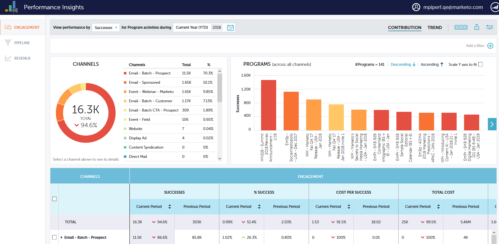

# 性能分析概述 {#performance-insights-overview}

Marketo性能分析可帮助您优化渠道组合，以实现最大效果，并发现长期趋势以发现一致的入选策略。

>[!AVAILABILITY]
>
>并非所有客户都购买了此功能。 有关详细信息，请联系您的客户成功经理。

性能分析会加载过去24个月的数据（最多）。 这包括当前年初至今的数据以及上一年的数据。例如，在2019年1月31日，MPI将从当月开始加载数据，从2018年起每月加载一次数据。 2019年12月31日，MPI将在2019年和2018年每月加载一次数据。

要访问性能分析，请单击Analytics主屏幕上的其图标。

## 贡献 {#contribution}

评估营销 [收入贡献](/help/marketo/product-docs/reporting/performance-insights/performance-insights-contribution-overview.md) 作为客户获取、影响、转化，甚至是基础设备增长的函数。

默认情况下，显示的数据按参与度反映绩效。 您只需单击其中一个，即可通过Pipeline或Revenue切换到性能。

## 趋势 {#trend}

发现 [长期趋势](/help/marketo/product-docs/reporting/performance-insights/performance-insights-trend-overview.md) 以发现一致的入选策略。

## 设置 {#settings}

在收入和管道功能板中，单击 [设置](/help/marketo/product-docs/reporting/performance-insights/performance-insights-settings.md) 图标以设置其他参数。

## 导出数据 {#export-data}

您可以在PowerPoint或Excel中导出数据和图表。 您还可以将它们另存为 [快速图表](/help/marketo/product-docs/reporting/performance-insights/performance-insights-quick-charts.md).

>[!NOTE]
>
>将数据导出到Excel，以查看所有渠道（而不仅仅是前十个渠道）的可用数据。 PPT导出将为WYSIWYG（输出将模拟您在屏幕上看到的内容）。
