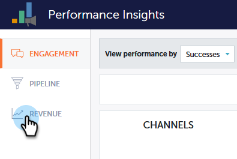

# 性能分析概述 {#performance-insights-overview}

Marketo Performance Insights可帮助您优化渠道组合以最大限度地提高效率，并揭示长期趋势以发现一致的入选策略。

>[!AVAILABILITY]
>
>并非每个人都购买了此功能。 有关详细信息，请联系Adobe客户团队（您的客户经理）。

性能分析加载的数据来自（最多）过去24个月。 这包括当前年初至今的数据以及前一年的数据。例如，在2019年1月31日，MPI将加载该月的数据，并从2018年起每月加载数据。 2019年12月31日，MPI将加载2019年和2018年的每月数据。

要访问Performance Insights，请在Analytics主屏幕上单击其图标。

## 贡献 {#contribution}

评估营销 [收入贡献](/help/marketo/product-docs/reporting/performance-insights/performance-insights-contribution-overview.md) 这是客户获取、影响、转化、甚至客户群增长的函数。

默认情况下，显示的数据反映“参与度”的绩效。 只需单击其中一个选项，即可通过Pipeline或Revenue切换性能。

## 趋势 {#trend}

发现 [长期趋势](/help/marketo/product-docs/reporting/performance-insights/performance-insights-trend-overview.md) 找出一贯的获胜策略。

## 设置 {#settings}

在收入和管道功能板中，单击 [设置](/help/marketo/product-docs/reporting/performance-insights/performance-insights-settings.md) 图标来设置其他参数。

## 导出数据 {#export-data}

可以在PowerPoint或Excel中导出数据和图表。 您还可以将它们另存为 [快速图表](/help/marketo/product-docs/reporting/performance-insights/performance-insights-quick-charts.md).

>[!NOTE]
>
>将数据导出到Excel以查看所有渠道（不仅仅是前十个）的可用数据。 PPT导出将为WYSIWYG（输出将模拟您在屏幕上看到的内容）。
