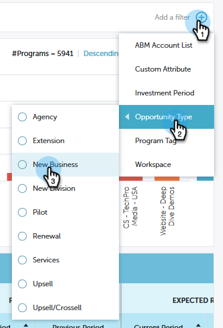

# 性能分析快速图表{#performance-insights-quick-charts}

“快速图表”是您自定义和保存的缩略图，提供了您最常用的图表的快速视图。

## 新建快速图{#create-a-new-quick-chart}

快速图表从您指定的数据派生。 在此示例中，我们将选择：**new opportunities(first touch), opportunity type = new business， current year-to-date**.

1. 单击日期过滤器，然后选择&#x200B;**当前年份(YTD)**。

   

1. 单击&#x200B;**+**&#x200B;并选择条件。

   

1. 图表会更新，以反映您选择的过滤器。

   

1. 单击“导出”图标，然后选择&#x200B;**另存为快速图表**。

   

1. 命名快速图表，然后单击&#x200B;**保存**。

   

您的快速图表现在与其他人一起使用。

>[!NOTE]
>
>您最多可以有20个快速图表。 可以删除和替换它们。

## 视图现有快速图表{#view-existing-quick-charts}

1. 要视图现有的快速图表，只需单击&#x200B;**快速图表**&#x200B;图标。

   

## 删除快速图表{#delete-a-quick-chart}

如果需要删除快速图表，请执行以下简单步骤。

1. 单击&#x200B;**快速图表**&#x200B;图标。

   

1. 将鼠标悬停在所需的图表上，但不要单击它。 悬停时，将显示X。 单击&#x200B;**X**。

   

1. 单击&#x200B;**删除**。

   
