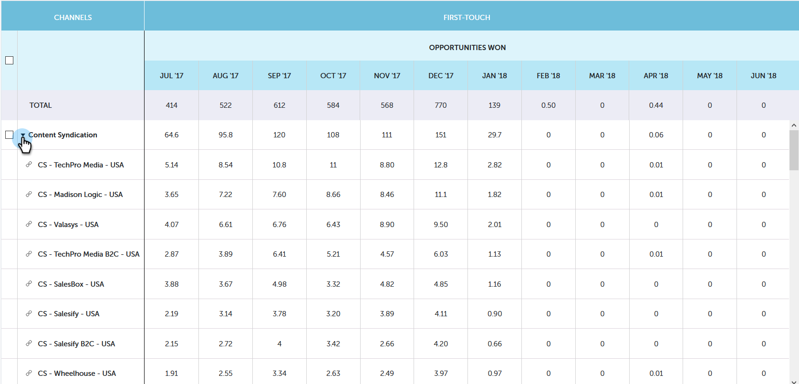

# 性能分析趋势概述 {#performance-insights-trend-overview}

趋势显示在一段时间内的渠道性能。

单击 **趋势** 选项卡访问此视图。

## 趋势 {#trend}

选择要作为查看性能的依据的度量。 在此示例中，我们将查看通过以下方式赢得的机会 [首次接触](/help/marketo/product-docs/reporting/revenue-cycle-analytics/revenue-tools/attribution/understanding-attribution.md).

量度通过两个图表显示：圆环图和折线图。

圆环图显示所选量度的前十个渠道。

折线图显示过去12个月内所选度量的渠道性能趋势。

选择一个或多个渠道，线形图显示渠道趋势。 再次单击渠道可取消选择。

下方的数据网格的功能类似于电子表格，其中显示过去12个月选定指标的所有可用趋势数据。

展开一个渠道可查看其前10个项目，其余项目合并在一起。

>[!NOTE]
>
>单击圆环图中的渠道旁边的复选框可激活/停用渠道。
