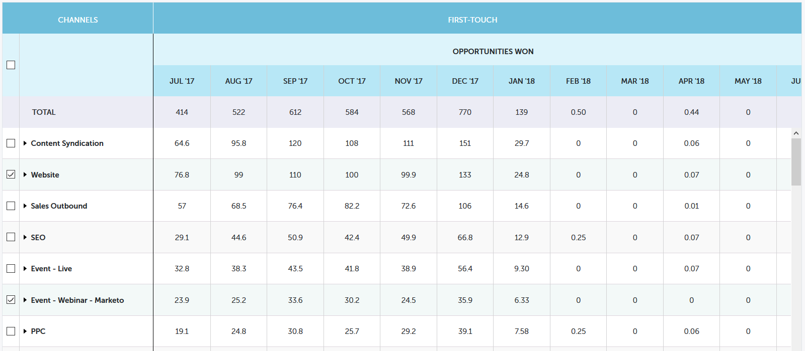

# 性能分析趋势概述 {#performance-insights-trend-overview}

趋势显示一段时间内的渠道性能。

单击 **趋势** 选项卡访问此视图。

## 趋势 {#trend}

选择要按以下方式查看性能的量度。 在本例中，我们将查看通过 [首次接触](/help/marketo/product-docs/reporting/revenue-cycle-analytics/revenue-tools/attribution/understanding-attribution.md).

量度通过以下两个图表显示：甜甜圈和线。

圆环图显示所选量度的前十个渠道。

折线图可显示您选择的量度在过去12个月内的渠道性能趋势。

选择一个或多个渠道，折线图会显示渠道趋势。 再次单击渠道以取消选择。

下面的数据网格的功能与电子表格类似，可显示您选择的量度过去12个月的所有可用趋势数据。

扩展渠道以查看其前十个项目，其余项目合并在一起。

>[!NOTE]
>
>单击渠道激活/停用图表中该渠道旁边的复选框。
