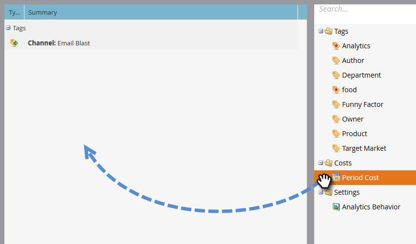

# 设置性能分析 {#setting-up-performance-insights}

按照以下步骤设置MPI。

## 机会设置 {#opportunity-setup}

1. 单击 **管理员**.

   

1. 单击 **收入周期分析**.

   

   >[!NOTE]
   >
   >如果没有RCA，则需要选择 **程序分析** （对于步骤2）。

1. 在归因下，单击 **编辑**.

   

1. 此时会显示归因设置。

   

   如果Attribution是明确的，请确保已填充Opportunity Contact Role（通过Opportunity Role端点或通过CRM集成）。

   如果Attribution是隐式的，请确保潜在客户/联系人上的公司字段与业务机会的帐户名称相同。

   >[!NOTE]
   >
   >确保所有机会都填充了相应的字段：
   >
   >* 机会金额
   >* 已关闭
   >* Is Won
   >* 创建日期（在您的情况下，可能未设置此日期）
   >* 关闭日期（在您的情况下可能未设置此日期）
   >* 机会类型

## 程序设置 {#program-setup}

至少更新12个月的方案费用。 您可以手动或使用程序API来执行此操作。 在本例中，我们手动执行此操作。

1. 单击 **营销活动**.

   

1. 查找并选择您的项目。

   

1. 单击 **设置** 选项卡。

   

1. 拖动 **期间成本** 放在画布上。

   

1. 将计划月份设置为至少12个月前，然后单击 **确定**.

   

1. 设置期间成本并单击 **保存**.

   

接下来，查看分析行为以指示是否应将特定渠道包含在分析中。 设置Analytics行为（正常、包含、操作）。

1. 单击 **管理员**.

   

1. 单击 **标记**.

   

1. 单击 **+** 以展开渠道列表。

   

1. 双击所需的渠道。

   

1. 单击 **Analytics行为** 下拉菜单，然后选择所需的行为。

   

1. 设置成功标准。

   

1. 单击 **保存**.

   

## 将程序与人员绑定 {#tie-the-program-to-the-person}

1. 确保为数据库中的每个人设置了客户获取程序和客户获取日期，以便首次联系归因正常工作。
1. 确保您的项目为您的人员设置成功状态。

>[!NOTE]
>
>所做更改并非即时更改。 更改生效前需要隔夜时间。
