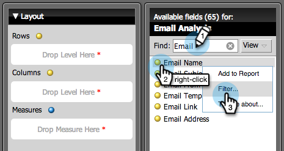

# 生成分析主持的电子邮件列表报告 {#build-an-email-analysis-report-that-lists-leads}

>[!NOTE]
>
>**可用性**
>
>并非所有客户都购买了此功能。 有关详细信息，请与销售代表联系。

请按照以下步骤创建电子邮件分析报告，其中将显示向您发送特定电子邮件的每个潜在客户，该报告还将包括单击和打开统计信息。 1.启动收入浏览器。

1. 单击“新建报告”。

   

1. 选择“电子邮件分析”区域，然后单击“确定”。

   

1. 找到“电子邮件名称”黄点，右键单击它并选择“筛选器”。

   

1. 多次单击列表中您选择的电子邮件，然后单击“确定”。

   

1. 将“电子邮件名称”黄点拖到“列”上。

   

   >[!TIP]
   >
   >有许多潜在客户/公司属性，您可以添加为列，将其检出！

1. 找到全名黄点并将其拖动到行上。

   

1. 现在，通过单击多次添加您感兴趣的测量。

   

>[!NOTE]
>
>根据您拥有此报告的数据量，刷新可能需要一段时间。

现在，您完成了报告后，其外观应类似于：   

任务完成！
