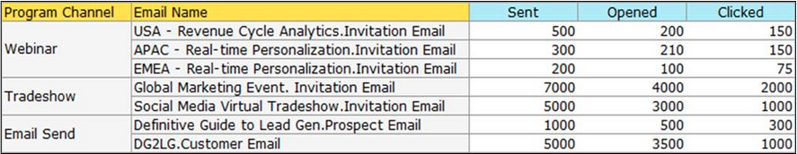

# 生成显示分析信息{#build-an-email-analysis-report-that-shows-program-information}的电子邮件项目报告

请按照以下步骤创建电子邮件分析报告，其中显示按项目渠道分组的电子邮件信息。

>[!AVAILABILITY]
>
>并非所有客户都购买了此功能。 有关详细信息，请与您的销售代表联系。

1. 启动&#x200B;**收入浏览器**。

   

1. 单击&#x200B;**新建报表**。

   

1. 选择&#x200B;**电子邮件分析**&#x200B;区域，然后单击&#x200B;**确定**。

   

1. 找到&#x200B;**已发送（周）**&#x200B;黄点并右键单击它。 单击&#x200B;**过滤器**。

   >[!NOTE]
   >
   >这将缩短报告的时间范围。

   

1. 选中&#x200B;**当前发送周**，然后单击&#x200B;**确定**。

   

1. 查找并多次单击&#x200B;**项目渠道**&#x200B;黄点。

   

1. 查找并多次单击&#x200B;**电子邮件名称**&#x200B;黄点。

   

1. 查找并多次单击&#x200B;**已发送**、**已打开**&#x200B;和&#x200B;**已单击**&#x200B;蓝点。

   

   干得好！ 您应该有一个类似于以下内容的报告：

   
