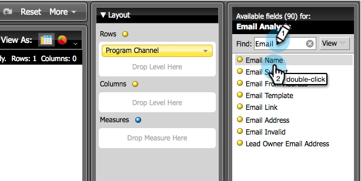
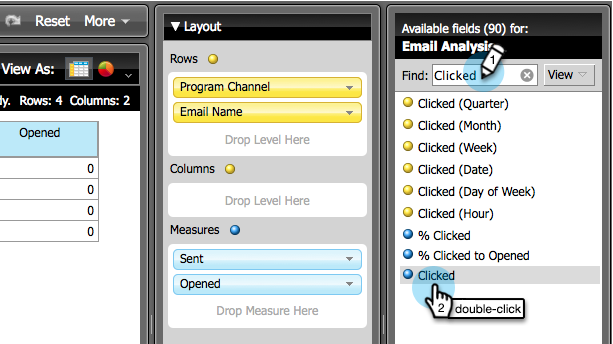

# 构建显示计划信息的电子邮件分析报告 {#build-an-email-analysis-report-that-shows-program-information}

按照以下步骤创建电子邮件分析报告，该报告将显示按项目群渠道分组的电子邮件信息。

>[!AVAILABILITY]
>
>并非每个人都购买了此功能。 有关详细信息，请联系Adobe客户团队（您的客户经理）。

1. 启动&#x200B;**[!UICONTROL Revenue Explorer]**。

   

1. 单击&#x200B;**[!UICONTROL Create New]**&#x200B;并选择&#x200B;**[!UICONTROL Report]**。

   

1. 选择&#x200B;**[!UICONTROL Email Analysis]**&#x200B;区域并单击&#x200B;**[!UICONTROL OK]**。

   

1. 找到&#x200B;**[!UICONTROL Sent (Week)]**&#x200B;个黄点，并右键单击它。 单击 **[!UICONTROL Filter...]**。

   >[!NOTE]
   >
   >这将缩短报告的时间范围。

   

1. 检查&#x200B;**[!UICONTROL Current Sent (Week)]**&#x200B;并单击&#x200B;**[!UICONTROL OK]**。

   

1. 查找并双击&#x200B;**[!UICONTROL Program Channel]**&#x200B;黄点。

   

1. 查找并双击&#x200B;**[!UICONTROL Email Name]**&#x200B;黄点。

   

1. 查找并双击&#x200B;**[!UICONTROL Sent]**、**[!UICONTROL Opened]**&#x200B;和&#x200B;**[!UICONTROL Clicked]**&#x200B;蓝点。

   

   做得好！您应该有一个类似于下面的报表：

   
