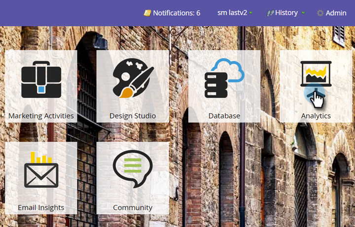
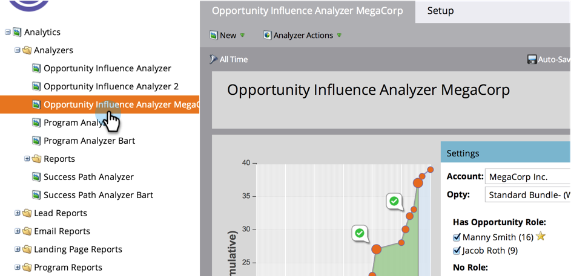

# 配置Opportunity Influence Analyzer {#configure-an-opportunity-influence-analyzer}

一旦您 [创建Opportunity Influence Analyzer](/help/marketo/product-docs/reporting/revenue-cycle-analytics/opportunity-influence-analyzer/create-an-opportunity-influence-analyzer.md)，您可以配置类型 [有趣时刻](/help/marketo/product-docs/marketo-sales-insight/msi-for-salesforce/features/tabs-in-the-msi-panel/interesting-moments/interesting-moments-overview.md) 包含的URL路径。

>[!PREREQUISITES]
>
>[创建机会影响分析器](/help/marketo/product-docs/reporting/revenue-cycle-analytics/opportunity-influence-analyzer/create-an-opportunity-influence-analyzer.md)

1. 单击 **分析**.

   

1. 转到Analytics并选择您的Opportunity Influence Analyzer。

   

   如果分析器图中有太多有趣的时刻，您可以通过取消选择 **设置** 面板，或者通过减少有趣时刻的类型。

1. 要配置要包含哪些类型的有趣时刻，请转到“设置”选项卡，然后拖入“有趣时刻”过滤器。

   

1. 选择是显示“全部”、“无”还是“部分”。

   

1. 如果选择“部分”，则可以选择要包含的类型。

   

1. 单击您想要的每种有趣时刻。 然后单击 **保存**.

1. 单击主选项卡，查看只有选定类型的有趣时刻的销售机会的历史记录。

   

>[!MORELIKETHIS]
>
>[用Opportunity Influence Analyzer讲述营销故事](/help/marketo/product-docs/reporting/revenue-cycle-analytics/opportunity-influence-analyzer/tell-the-marketing-story-with-an-opportunity-influence-analyzer.md)
