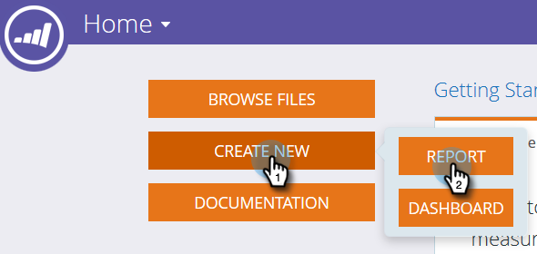

# 构建列出潜在客户的计划会员资格分析报告 {#build-a-program-membership-analysis-report-that-lists-leads}

按照以下步骤创建项目群成员资格分析报告，该报告将显示所有项目群成员名称。

>[!AVAILABILITY]
>
>并非所有客户都已购买此功能。 有关详细信息，请与您的销售代表联系。

1. 启动Revenue Explorer。

   

1. 单击 **新建** 则 **报表**.

   

1. 选择 **计划会员资格分析** 并单击 **确定**.

   

1. 查找并双击程序名称黄色圆点。

   

1. 查找并双击成员蓝点。

   

1. 找到并双击Success (Total)(成功（总计）)蓝点。

   

看看这有多容易？

您可以快速添加潜在客户属性，例如 _全名_ 查看成员身份。

>[!TIP]
>
>有许多潜在客户/公司属性可供选择。 看看他们！

1. 查找并双击 **全名** 黄点。

   

拿着！

