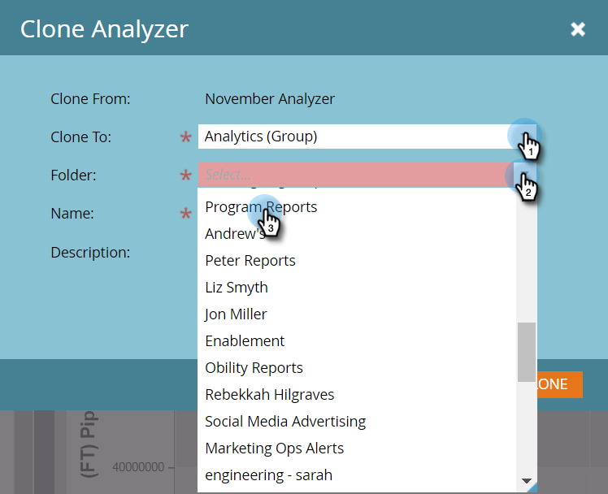

# 克隆程序分析器 {#clone-a-program-analyzer}

保存分析器后，可以轻松克隆分析器以创建新分析器。 然后，如果新文件需要更改，请进入并编辑。

1. 单击 **分析** 图块。

   

1. 单击 **程序分析器** 图块。

   

1. 当保存的分析器处于打开状态时，打开Analyzer“操作”下拉菜单并选择 **克隆分析器**.

   

1. 从中选择克隆的分析器的位置 **克隆到** 和 **文件夹** 下拉列表。

   

1. 命名克隆的分析器并单击 **克隆**.

   

1. 现在，您有两个名称不同的相同分析器。 打开克隆以进行任何必要的更改。

   

   >[!MORELIKETHIS]
   >
   >[创建程序分析器](/help/marketo/product-docs/reporting/revenue-cycle-analytics/program-analytics/create-a-program-analyzer.md)
