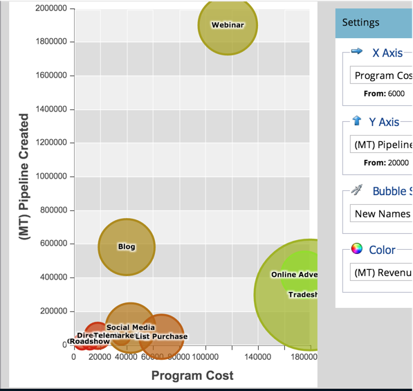

# 将通道有效性与程序分析器进行比较 {#compare-channel-effectiveness-with-the-program-analyzer}

使用程序分析器比较渠道成本、成员获取、管道、收入等，以确定最有效、最不有效的渠道。

>[!PREREQUISITES]
>
>[创建程序分析器](/help/marketo/product-docs/reporting/revenue-cycle-analytics/program-analytics/create-a-program-analyzer.md)

1. 单击 **Analytics** in **我的Marketo**.

   

1. 选择 **程序分析器**.

   

1. 将视图更改为 **按渠道**.

   

1. 使用 **X轴** 下拉菜单，为水平轴选择量度。 让我们从 **计划成本**.

   

1. 使用“Y轴”下拉列表为垂直轴选择一个量度。 来，我们一起去 **(FT)管道已创建**.

   

   >[!NOTE]
   >
   >在程序分析器中可以选择的许多量度都可通过首次联系(FT)和多次联系(MT)计算获得。 了解 [FT归因与MT归因的差异](/help/marketo/product-docs/reporting/revenue-cycle-analytics/revenue-tools/attribution/understanding-attribution.md).

1. 使用 **Y轴** 下拉列表进行选择 **(MT)管道已创建**.

   

   在此多接触点归因视图中，我们发现网络研讨会渠道对创建的渠道的影响更大，并且成本比贸易展和在线广告渠道低。

   现在，让我们再添加两个维度！

1. 使用 **气泡大小** 下拉列表以选择其他度量，如 **新名称**.

   

1. 观看图表的更改情况。

   

   我们发现网络研讨会渠道会萎缩，如 **新名称**. 我们可以得出结论，尽管它拥有许多成员，但它在创造新商机方面不如贸易展渠道有效。

1. 最后，使用颜色下拉列表添加第四个维度。 让我们选择 **(FT)收入赢得**.

   

1. 观看图表中的颜色变化。

   

   从颜色上，我们了解到贸易展渠道，即最绿色的泡沫，已经影响了通过首次接触归因计算的最大收入。

1. 现在，如果我们将“颜色”量度更改为 **(MT)赢得的收入**，我们发现，与网络研讨会和贸易展渠道相比，现在最绿色的在线广告渠道对一段时间内的收入产生了更大的影响。

   

在本例中，我们发现在测量由首次接触创建的管道时，贸易展渠道既是最昂贵（最右边），也是最成功（Y轴最高）。 现在，让我们考虑通过多接触点归因来测量每个渠道的管道。

>[!TIP]
>
>这些步骤中的示例基于创建的管道来衡量有效性。 使用Y轴下拉列表选择其他衡量渠道有效性的方法，如新名称、成员、每次成功的成本等。

>[!MORELIKETHIS]
>
>* [使用程序分析器探索程序和渠道详细信息](/help/marketo/product-docs/reporting/revenue-cycle-analytics/program-analytics/explore-program-and-channel-details-with-the-program-analyzer.md)
>* [将程序有效性与程序分析器进行比较](/help/marketo/product-docs/reporting/revenue-cycle-analytics/program-analytics/compare-program-effectiveness-with-the-program-analyzer.md)

