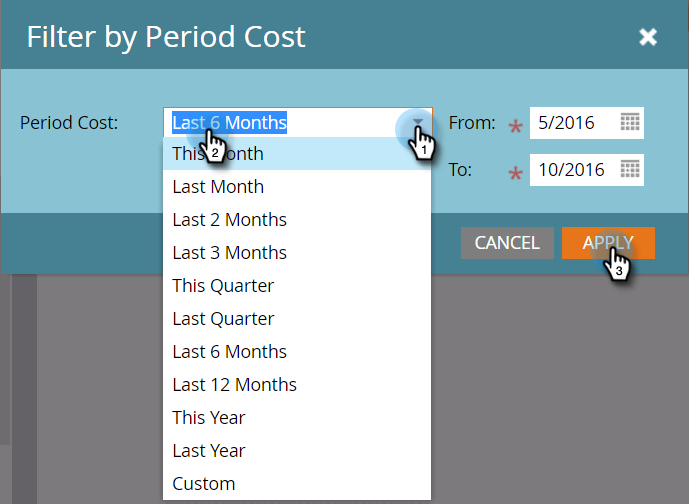
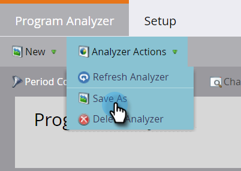

# 创建程序分析器 {#create-a-program-analyzer}

探索哪些项目和渠道可为您带来最大的营销回报。 使用项目分析器按项目或渠道详细检查和比较每项成本和回报。

>[!NOTE]
>
>要从程序分析器中获取有效数据，请确保您的CRM联系人具有参与机会的角色，并且您的Marketo程序已完全设置，具有 [期间成本](/help/marketo/product-docs/reporting/revenue-cycle-analytics/revenue-tools/define-period-costs.md)、项目状态和定义的成功次数。

>[!TIP]
>
>要使无成本程序出现在程序分析器中， [设置其期间成本](/help/marketo/product-docs/reporting/revenue-cycle-analytics/revenue-tools/define-period-costs.md) 到0美元。

1. 单击 **分析** 磁贴。

   

1. 单击 **程序分析器** 磁贴。

   

1. 出现标准程序分析器。 根据需要对其进行任何更改。

   

1. 单击 **设置** 选项卡以添加和自定义筛选器。

   

1. 例如，要自定义“期间成本”筛选器，请双击该筛选器。

   

1. 选择要分析的时间段，然后单击 **应用**.

   

   >[!TIP]
   >
   >要选择特定范围，请选择 **自定义** 并使用 **从** 和 **至** 字段。

1. 如果要保存新的自定义分析器，请在“分析器操作”下拉列表中，选择 **另存为**.

   

1. 使用保存到和文件夹下拉列表，选择要保存自定义分析器的位置。 命名新的自定义分析器。 说明是可选的。 单击 **保存**.

   

1. 你做到了！ 单击主选项卡，开始浏览和比较程序和渠道。

>[!NOTE]
>
>您可以在程序分析器中选择的许多量度都可用于首次联系(FT)和多点联系(MT)计算。 了解 [ft和MT归因之间的差异](/help/marketo/product-docs/reporting/revenue-cycle-analytics/revenue-tools/attribution/understanding-attribution.md).

>[!MORELIKETHIS]
>
>* [使用项目分析器比较渠道有效性](/help/marketo/product-docs/reporting/revenue-cycle-analytics/program-analytics/compare-channel-effectiveness-with-the-program-analyzer.md)
>* [使用程序分析器比较程序有效性](/help/marketo/product-docs/reporting/revenue-cycle-analytics/program-analytics/compare-program-effectiveness-with-the-program-analyzer.md)
>* [使用计划分析器浏览计划和渠道详细信息](/help/marketo/product-docs/reporting/revenue-cycle-analytics/program-analytics/explore-program-and-channel-details-with-the-program-analyzer.md)
>* [克隆程序分析器](/help/marketo/product-docs/reporting/revenue-cycle-analytics/program-analytics/clone-a-program-analyzer.md)
