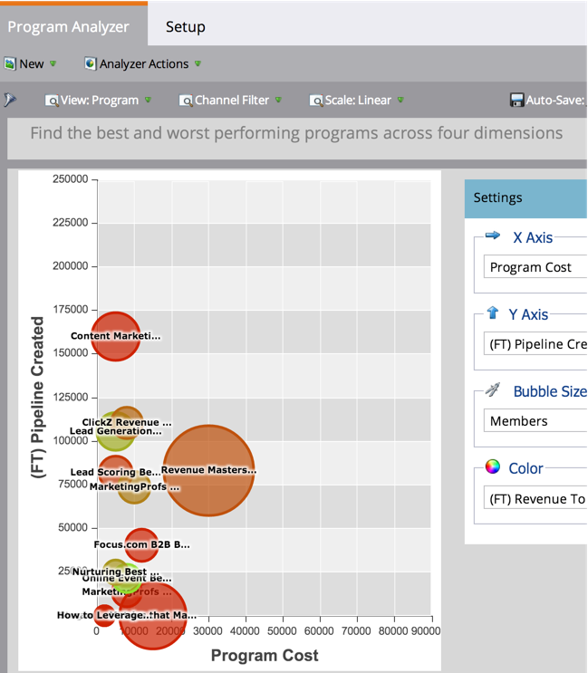

# 使用计划分析器浏览计划和渠道详细信息 {#explore-program-channel-details-with-the-program-analyzer}

您可以在项目分析器中查看详细的项目和渠道统计信息。 您还可以在Revenue Cycle Explorer中打开它们。

>[!PREREQUISITES]
>
>[创建程序分析器](/help/marketo/product-docs/reporting/revenue-cycle-analytics/program-analytics/create-a-program-analyzer.md)

>[!AVAILABILITY]
>
>并非所有Marketo版本都包含此功能。 有关更多详细信息，请与您的客户经理联系。

1. 单击 **分析**.

   

1. 选择程序分析器。

   

1. 查看渠道或项目群的特定统计信息(取决于 **视图** 选择)，单击相应的气泡。

   

   >[!NOTE]
   >
   >您可以在程序分析器中选择的许多量度都可用于首次联系(FT)和多点联系(MT)计算。 了解 [ft和MT归因之间的差异](/help/marketo/product-docs/reporting/revenue-cycle-analytics/revenue-tools/attribution/understanding-attribution.md).

1. 要比较单个频道中的所有节目，请单击弹出对话框中的频道名称。

   

1. 现在，您可以比较该渠道中的各个项目！

   

   >[!NOTE]
   >
   >单击单个渠道可将您的视图切换为“按项目群”，仅对该渠道进行过滤。 要返回到所有渠道，请选择 **视图** > **按渠道**.

1. 要打开Revenue Cycle Explorer以更深入地挖掘统计数据，请在弹出对话框中单击该数字。

   
