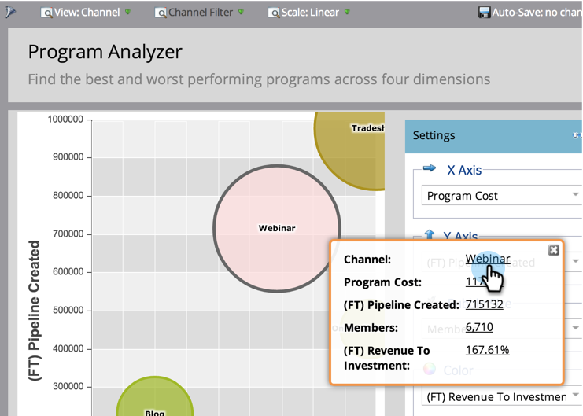

# 使用程序分析器探索程序和渠道详细信息 {#explore-program-channel-details-with-the-program-analyzer}

您可以在节目分析器中查看详细的节目和渠道统计资料。 您还可以在收入周期浏览器中打开它们。

>[!PREREQUISITES]
>
>[创建程序分析器](/help/marketo/product-docs/reporting/revenue-cycle-analytics/program-analytics/create-a-program-analyzer.md)

>[!AVAILABILITY]
>
>并非所有Marketo版本都包含此功能。 有关更多详细信息，请联系您的客户经理。

1. 单击 **Analytics**.

   

1. 选择程序分析器。

   

1. 查看渠道或节目的特定统计信息(具体取决于 **查看** 选择)，单击相应的气泡。

   

   >[!NOTE]
   >
   >在程序分析器中可以选择的许多量度都可通过首次联系(FT)和多次联系(MT)计算获得。 了解 [FT归因与MT归因的差异](/help/marketo/product-docs/reporting/revenue-cycle-analytics/revenue-tools/attribution/understanding-attribution.md).

1. 要比较单个渠道中的所有节目，请单击弹出对话框中的渠道名称。

   

1. 现在，您可以比较该渠道中的各个项目！

   

   >[!NOTE]
   >
   >单击单个渠道会将视图切换为按项目，并过滤到仅该渠道。 要返回到所有渠道，请选择 **查看** > **按渠道**.

1. 要打开收入周期浏览器以更深入地挖掘统计信息，请在弹出对话框中单击该数字。

   
