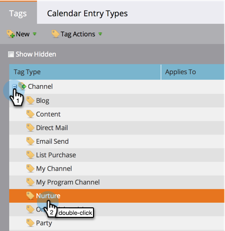

# 使无期间成本的程序在收入浏览器和分析器中可用 {#make-a-program-without-a-period-cost-available-in-revenue-explorer-and-analyzers}

计划期间成本允许您为计划定义“多少钱”和“何时”。 这显示在Revenue Cycle Explorer和 [分析器](/help/marketo/product-docs/reporting/revenue-cycle-analytics/opportunity-influence-analyzer/tell-the-marketing-story-with-an-opportunity-influence-analyzer.md).

>[!NOTE]
>
>**需要管理员权限**

即使没有期间成本，也可能需要纳入某些计划。 虽然您可以输入0作为期间成本，但我们已使纳入这些计划更加容易。

>[!NOTE]
>
>计划分析器按期间成本存储计划成功。 如果没有可用的期间成本，则无论项目的分析行为如何，都不会显示“项目成功”。 如果设置了Analytics行为，将显示机会量度（管道机会、获得的收入等）的数据。

1. 在管理员部分下，单击 **标记**.

   

1. 展开渠道并双击所选渠道。

   >[!NOTE]
   >
   >使用此渠道的所有程序，无论期间成本如何，都将可供收入浏览器和分析器使用。 此更改将在第二天生效。

   

1. 将Analytics行为更改为“包含” ，然后单击 **保存**.

   

>[!TIP]
>
>您注意到了“可操作”选项吗？ 事实正好相反。 它不包括这些计划，而不考虑期间成本。

做得好！ 现在，任何使用修改后的渠道的计划都将包含在收入浏览器和分析器中，而无需支付期间成本。

>[!MORELIKETHIS]
>
>[覆盖项目级别的Analytics行为](/help/marketo/product-docs/reporting/revenue-cycle-analytics/program-analytics/override-analytics-behavior-at-the-program-level.md)
