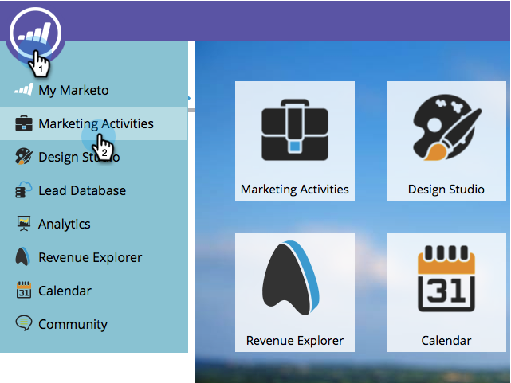

# 在项目层级覆盖分析行为 {#override-analytics-behavior-at-the-program-level}

您可以在渠道[上的管理员级别设置](/help/marketo/product-docs/reporting/revenue-cycle-analytics/program-analytics/make-a-program-without-a-period-cost-available-in-revenue-explorer-and-analyzers.md)分析行为，但也可以在项目级别覆盖它。 方法如下：

1. 进入 **[!UICONTROL Marketing Activities]** 区域。

   

1. 查找并选择您的项目。

   

1. 在&#x200B;**[!UICONTROL Setup]**&#x200B;选项卡下，将[!UICONTROL Analytics Behavior]拖到画布中。

   

1. 选择所需的[!UICONTROL Analytics Behavior]。

   >[!NOTE]
   >
   >**定义**
   >
   >* **包含** — 此选项将确保程序可用于在收入资源管理器和分析器中报告，无论您是否包含期间成本。
   >* **可操作的** — 此选项导致程序未显示在收入资源管理器或分析器中。

   >[!NOTE]
   >
   >默认行为（如果未应用此设置）是，仅当至少有一个期间成本&#x200B;**时，项目才会包含在Analytics**&#x200B;中，即使分配了零美元的期间成本也是如此。

   

1. 单击 **[!UICONTROL Save]**。

   

做得好！ 现在您知道如何在程序级别覆盖分析行为了。

>[!NOTE]
>
>这些更改将在第二天生效，并且或者可供使用，或者从收入资源管理器和分析器中提取。
