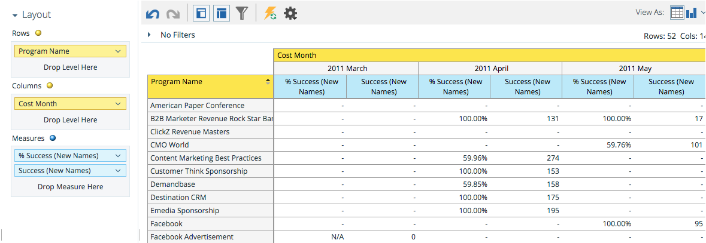

# 了解项目成本分析区域{#understanding-the-program-cost-analysis-area}

“项目成本分析”区域允许您分析单个项目的效率，或查看指定时间段内按渠道列出的汇总结果。

## 业务问题示例{#example-business-questions}

每个渠道每月生成多少个新名称？

按每月渠道计算，我的每个新名称费用是多少？

在项目中生成的新名称中，成功的百分比是多少？

我每个项目每月花多少钱？

## 项目成本分析Dimension和度量{#program-cost-analysis-dimensions-and-measures}

>[!NOTE]
>
>黄点是尺寸，蓝点是度量。

## 投资{#investment}

| 度量 | 说明 |
|---|---|
| 每个会员的成本 | 项目每个成员的平均成本 |
| 每个新名称的成本 | 项目获得的每个销售线索平均成本 |
| 每次成功的成本 | 在项目发展中取得成功的每个销售线索的平均成本 |
| 每次成功的成本（新名称） | 由项目AND获得的每个销售线索的平均成本在项目的发展中取得了成功 |
| 项目成本 | 项目的期间总成本 |

## 成员资格{#membership}

<table> 
 <tbody> 
  <tr> 
   <th>度量</th> 
   <th>说明</th> 
  </tr> 
  <tr> 
   <td>%新名称</td> 
   <td>由项目获得的销售线索百分比</td> 
  </tr> 
  <tr> 
   <td>成员</td> 
   <td>某个项目中的潜在客户总数</td> 
  </tr> 
  <tr> 
   <td>新名称</td> 
   <td>项目获取的新名称总数</td> 
  </tr> 
 </tbody> 
</table>

## 项目属性{#program-attributes}

| Dimension | 说明 |
|---|---|
| 项目渠道 | 项目渠道 |
| 项目名称 | 项目名称 |

## 项目成本时间范围{#program-cost-timeframe}

| Dimension | 说明 |
|---|---|
| 年 | 项目成本时间范围 |
| 季度 | 项目成本时间范围 |
| 月 | 项目成本时间范围 |

## 项目标签{#program-tags}

| 度量 | 说明 |
|---|---|
| 行业 | 项目标签 |
| 产品线 | 项目标签 |
| 项目所有者 | 项目标签 |
| 地区 | 项目标签 |

## 成功{#success}

| 度量 | 说明 |
|---|---|
| %成功（新名称） | 由项目AND获得的销售线索在项目发展中取得成功的百分比 |
| 成功率（总计） | 在项目进展中成功的潜在客户百分比 |
| 成功（新名称） | 在项目发展中取得成功的新姓名总数 |
| 成功（总计） | 在项目进展中成功的潜在客户总数 |
