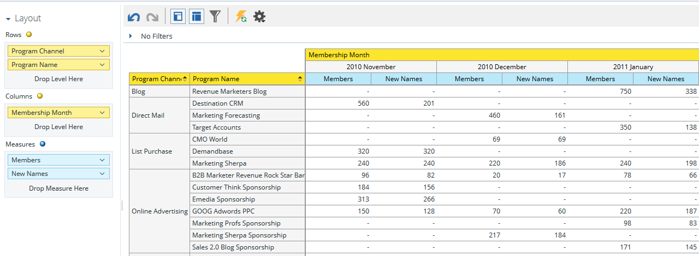

# 了解项目成员分析区域{#understanding-the-program-membership-analysis-area}

项目会员资格分析区域允许您分析各个项目的有效性，或查看指定时间段内按渠道列出的汇总结果。

## 业务问题示例{#example-business-questions}

在一个指定月中有多少人按渠道参加项目?

有多少人达到了给定项目的成功标准？

每个项目/渠道每月生成多少个新名称？

## 项目会员分析Dimension和措施{#program-membership-analysis-dimensions-and-measures}

>[!NOTE]
>
>黄点是尺寸，蓝点是度量。

### 成员资格{#membership}

| 度量 | 说明 |
|---|---|
| %新名称 | 在项目中获得的销售线索百分比 |
| 成员 | 某个项目中的潜在客户总数 |
| 新名称 | 项目获取的新名称总数 |

### 项目属性{#program-attributes}

| Dimension | 说明 |
|---|---|
| 项目渠道 | 项目渠道 |
| 项目名称 | 项目名称 |

### 项目会员资格时间范围{#program-membership-timeframe}

| Dimension | 说明 |
|---|---|
| 年 | 项目会员资格时间 |
| 季度 | 项目会员资格时间 |
| 月 | 项目会员资格时间 |
| 周 | 项目会员资格时间 |
| 日期 | 项目会员资格时间 |

### 成功{#success}

| 度量 | 说明 |
|---|---|
| %成功（新名称） | 由项目AND获得的销售线索在项目发展中取得成功的百分比 |
| 成功率（总计） | 在项目进展中成功的潜在客户百分比 |
| 成功（新名称） | 在项目发展中取得成功的新姓名总数 |
| 成功（总计） | 在项目进展中成功的潜在客户总数 |
