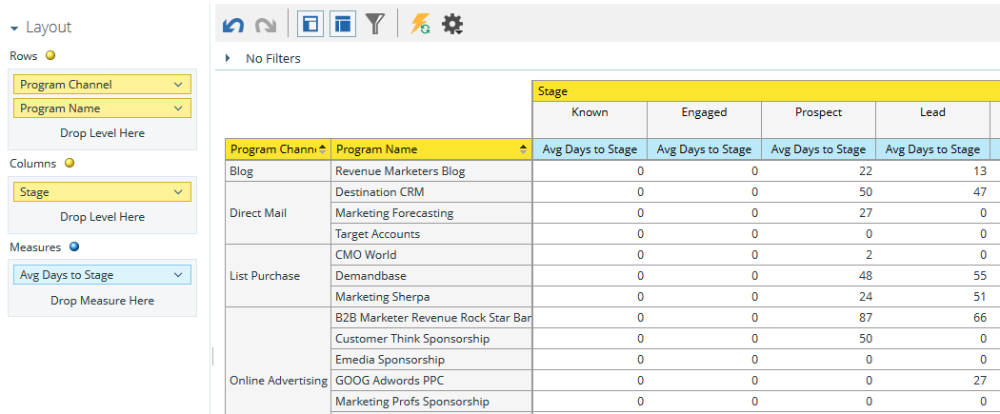

# 了解方案收入阶段分析区域 {#understanding-the-program-revenue-stage-analysis-area}

利用此分析区域，可分析各个程序的有效性或按渠道查看汇总结果。 它深入分析在您的收入周期模型中生成的新名称中有多少已达到特定的成功路径阶段。

**使用此分析区域可以回答的业务问题示例包括**:

一个给定项目中有多少新名称在我模型中达到了特定阶段？

给定项目中有多少个新名称当前处于我模型中的特定阶段？

要花多少天时间才能达到目前的阶段？

**方案收入阶段分析Dimension和措施**

Dimension和度量按功能分类，在系统中以黄色或蓝色圆点表示：尺寸为黄色，测量为蓝色。 使用计划收入阶段分析维度和量度来回答报表中的特定问题。

要查看类别中的可用维度或度量，请单击类别名称旁边的向右箭头以展开类别列表。 单击向下箭头可折叠类别列表。

>[!TIP]
>
>要在报表中获取有关特定维度或度量的更多信息，请将鼠标悬停在该维度或度量上。

**模型属性**

<table> 
 <tbody> 
  <tr> 
   <td colspan="1" rowspan="1"><strong>维度</strong></td> 
   <td colspan="1" rowspan="1">
<strong>描述</strong>
</td> 
  </tr> 
  <tr> 
   <td colspan="1" rowspan="1">
模型处于活动状态
</td> 
   <td colspan="1" rowspan="1">
描述模型当前是否已批准并处于活动状态
</td> 
  </tr> 
  <tr> 
   <td colspan="1" rowspan="1">
处于活动状态
</td> 
   <td colspan="1" rowspan="1">
描述阶段是否处于活动状态
</td> 
  </tr> 
  <tr> 
   <td colspan="1" rowspan="1">
成功路径
</td> 
   <td colspan="1" rowspan="1">
描述阶段是否处于成功路径中
</td> 
  </tr> 
  <tr> 
   <td colspan="1" rowspan="1">
模型
</td> 
   <td colspan="1" rowspan="1">
模型名称
</td> 
  </tr> 
  <tr> 
   <td colspan="1" rowspan="1">
阶段
</td> 
   <td colspan="1" rowspan="1">
收入周期模型中存在的阶段。 在分析两个阶段之间的措施时，用作“起始”阶段
</td> 
  </tr> 
  <tr> 
   <td colspan="1" rowspan="1">
阶段类型
</td> 
   <td colspan="1" rowspan="1">
描述类型；每个阶段的库存、SLA或Gate
</td> 
  </tr> 
 </tbody> 
</table>

**程序属性**

<table> 
 <tbody> 
  <tr> 
   <td colspan="1" rowspan="1">
<strong>维度</strong>
</td> 
   <td colspan="1" rowspan="1">
<strong>描述</strong>
</td> 
  </tr> 
  <tr> 
   <td colspan="1" rowspan="1">
节目渠道
</td> 
   <td colspan="1" rowspan="1">
节目渠道
</td> 
  </tr> 
  <tr> 
   <td colspan="1" rowspan="1">
项目名称
</td> 
   <td colspan="1" rowspan="1">
项目名称
</td> 
  </tr> 
 </tbody> 
</table>

**计划成本时间范围**

<table> 
 <tbody> 
  <tr> 
   <td colspan="1" rowspan="1">
<strong>维度</strong>
</td> 
   <td colspan="1" rowspan="1">
<strong>描述</strong>
</td> 
  </tr> 
  <tr> 
   <td colspan="1" rowspan="1">
成本年
</td> 
   <td colspan="1" rowspan="1">
计划成本时间范围
</td> 
  </tr> 
  <tr> 
   <td colspan="1" rowspan="1">
成本季度
</td> 
   <td colspan="1" rowspan="1">
计划成本时间范围
</td> 
  </tr> 
  <tr> 
   <td colspan="1" rowspan="1">
成本月份
</td> 
   <td colspan="1" rowspan="1">
计划成本时间范围
</td> 
  </tr> 
 </tbody> 
</table>

**阶段会员资格**

<table> 
 <tbody> 
  <tr> 
   <td colspan="1" rowspan="1">
<strong>测量</strong>
</td> 
   <td colspan="1" rowspan="1">
<strong>描述</strong>
</td> 
  </tr> 
  <tr> 
   <td colspan="1" rowspan="1">
模型处于活动状态
</td> 
   <td colspan="1" rowspan="1">
描述模型当前是否已批准并处于活动状态
</td> 
  </tr> 
  <tr> 
   <td colspan="1" rowspan="1">
处于活动状态
</td> 
   <td colspan="1" rowspan="1">
描述阶段是否处于活动状态
</td> 
  </tr> 
  <tr> 
   <td colspan="1" rowspan="1">
成功路径
</td> 
   <td colspan="1" rowspan="1">
描述阶段是否处于成功路径中
</td> 
  </tr> 
  <tr> 
   <td colspan="1" rowspan="1">
每个新名称的成本
</td> 
   <td colspan="1" rowspan="1">
一个新名称的平均成本
</td> 
  </tr> 
  <tr> 
   <td colspan="1" rowspan="1">
新名称（当前）
</td> 
   <td colspan="1" rowspan="1">
目前处于阶段并被方案获得的潜在客户总数
</td> 
  </tr> 
  <tr> 
   <td colspan="1" rowspan="1">
新名称（永）
</td> 
   <td colspan="1" rowspan="1">
描述类型；每个阶段的库存、SLA或Gate
</td> 
  </tr> 
 </tbody> 
</table>

>[!MORELIKETHIS]
>
>[创建收入浏览器报表](/help/marketo/product-docs/reporting/revenue-cycle-analytics/revenue-explorer/create-a-revenue-explorer-report.md)
