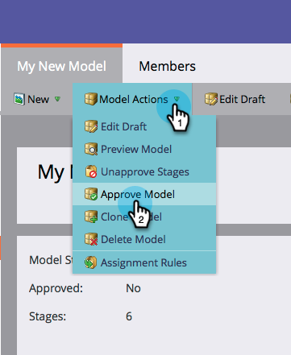

# 批准/取消批准收入模型 {#approve-unapprove-a-revenue-model}

您在任何给定时间都只能有一个已批准的模型。

>[!CAUTION]
>
>[必须批准各个阶段](/help/marketo/product-docs/reporting/revenue-cycle-analytics/revenue-cycle-models/approving-stages-and-assigning-leads-to-a-revenue-model.md) 以及在您批准整个模型之前添加的人员。

## 审批 {#approve}

1. 转到 **Analytics** 的上界。

   

1. 从树中选取模型。

   

1. 从 **模型操作** 菜单，选择 **批准模型**.

   

1. 此时将显示一个对话框以确认您的选择。 单击 **批准**.

   

您的模型现已上线！

## 取消批准 {#unapprove}

>[!CAUTION]
>
>如果取消批准模型，则所有人员都将从模型中删除，并且他们在模型中的历史记录将被删除！

1. 转到 **Analytics** 的上界。

   

1. 从树中选取模型。

   

1. 单击 **模型操作** 菜单和选择 **取消批准模型**.

   

1. 在出现的对话框中，单击 **取消批准模型**.

   

恭喜！ 您的模型现在未获批准。

>[!CAUTION]
>
>取消批准模型会删除模型中的所有人员，并从数据库中删除其模型中的历史记录。
