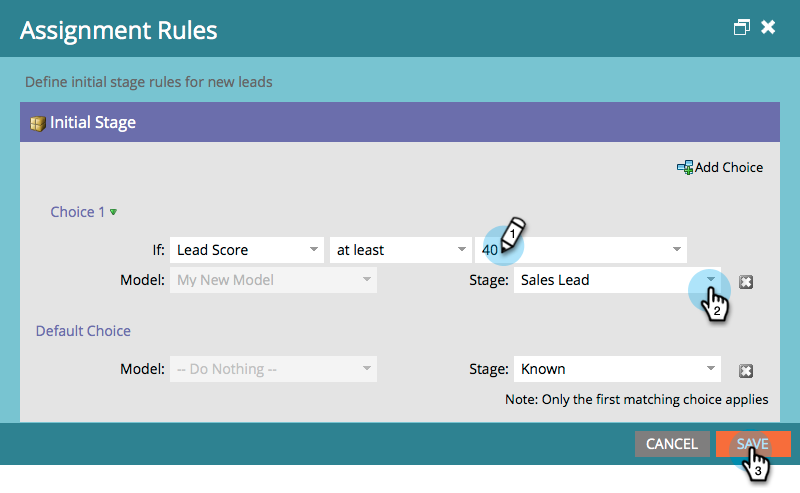

# 批准阶段并将潜在客户分配给收入模型{#approving-stages-and-assigning-leads-to-a-revenue-model}

通过添加现有潜在客户并为任何新潜在客户创建分配规则，使您的&#x200B;**收入模型**&#x200B;启动并运行。

## 批准阶段{#approving-stages}

让我们在添加任何潜在客户之前批准模型的阶段。

1. 转至&#x200B;**Analytics**&#x200B;区域。

   

1. 选择要批准其舞台的模型。

   

1. 在&#x200B;**模型操作**&#x200B;下，选择&#x200B;**批准阶段**。

   

1. 你会得到警报；单击&#x200B;**分配潜在客户**。

   

太棒了！ 让我们继续并分配这些潜在客户。

## 分配现有潜在客户{#assigning-existing-leads}

[创建智能列](/help/marketo/product-docs/core-marketo-concepts/smart-lists-and-static-lists/creating-a-smart-list/create-a-smart-list.md) 表，以在潜在客户数据库中标识模型的一个阶段的潜在客户。

1. 创建[智能列表](/help/marketo/product-docs/core-marketo-concepts/smart-lists-and-static-lists/creating-a-smart-list/create-a-smart-list.md)后，单击&#x200B;**潜在客户**&#x200B;选项卡。

   

1. 单击&#x200B;**全选**&#x200B;以选择潜在客户。

   

1. 打开&#x200B;**潜在客户操作**&#x200B;下拉框并选择&#x200B;**特殊**。 单击&#x200B;**更改收入阶段**。

   

1. 选择正确的&#x200B;**Model**&#x200B;和正确的&#x200B;**Stage**。 单击&#x200B;**立即运行**。

   

1. 重复上述步骤，直到将您的所有潜在客户分配到模型的各个阶段。

太棒了！ 要指定如何将新潜在客户分配给阶段，请创建分配规则。

>[!NOTE]
>
>如果您的模型处于“已批准的阶段”状态，您将不会在潜在客户的事件日志中看到任何“更改收入阶段”活动。 如果模型已完全批准，则如果将潜在客户移动到当前处于的同一阶段，将跳过此流步骤。

## 新潜在客户：创建分配规则{#new-leads-create-assignment-rules}

1. 再次单击&#x200B;**Marketo Home**，然后选择&#x200B;**Analytics**。

   

1. 在树中单击模型，然后单击&#x200B;**“模型操作”**&#x200B;菜单，选择&#x200B;**“分配规则”**。

   

1. 如果您的分配规则包含多个默认选项，请单击&#x200B;**Stage**，进行选择，然后单击&#x200B;**添加选择**。

   

## 分配规则示例{#example-assignment-rule}

创建“潜在客户得分”规则，以将具有最低得分的新潜在客户分配到相应的步骤。

1. 在&#x200B;**If**&#x200B;下，选择&#x200B;**潜在客户分数**。 然后，选择&#x200B;**至少**。

   

1. 在字段中输入&#x200B;**40**，然后选择&#x200B;**销售线索**&#x200B;作为阶段。 单击&#x200B;**保存**&#x200B;以完成。

   

>[!MORELIKETHIS]
>
>要批准您的模型，请阅读我们的帮助页面&#x200B;**[批准和取消批准收入模型](/help/marketo/product-docs/reporting/revenue-cycle-analytics/revenue-cycle-models/approve-unapprove-a-revenue-model.md)**。
