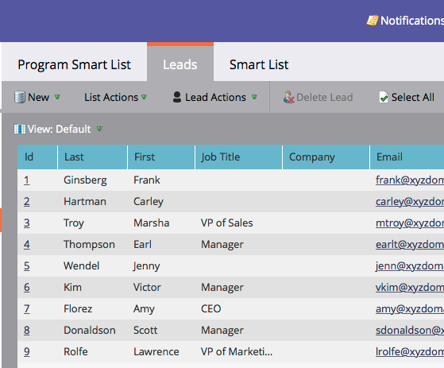

# 批准阶段并将潜在客户分配给收入模型 {#approving-stages-and-assigning-leads-to-a-revenue-model}

获取 **收入模型** 通过添加现有潜在客户，为任何新潜在客户创建分配规则来启动和运行。

## 批准阶段 {#approving-stages}

在添加任何潜在客户之前，我们先批准模型的各个阶段。

1. 转到 **Analytics** 的上界。

   

1. 选择要批准其阶段的模型。

   

1. 在 **模型操作**，选择 **批准阶段**.

   

1. 你会收到警报；单击 **分配潜在客户**.

   

太棒了！ 让我们继续分配这些潜在客户。

## 分配现有潜在客户 {#assigning-existing-leads}

[创建智能列表](/help/marketo/product-docs/core-marketo-concepts/smart-lists-and-static-lists/creating-a-smart-list/create-a-smart-list.md) 在潜在客户数据库中确定模型的一个阶段的潜在客户。

1. 一旦 [已创建智能列表](/help/marketo/product-docs/core-marketo-concepts/smart-lists-and-static-lists/creating-a-smart-list/create-a-smart-list.md)，请单击 **潜在客户** 选项卡。

   

1. 单击 **全选** 来选择潜在客户。

   

1. 打开 **潜在客户操作** 下拉框并选择 **特殊**. 单击 **更改收入阶段**.

   

1. 选择正确的 **模型** 正确 **阶段**. 单击 **立即运行**.

   

1. 重复上述步骤，直到将您的所有潜在客户分配到模型的各个阶段。

太棒了！ 要指定如何将新潜在客户分配到阶段，请创建分配规则。

>[!NOTE]
>
>如果您的模型处于已批准的阶段状态，您将不会在潜在客户的活动日志中看到任何更改收入阶段事件。 如果您的模型已获得完全批准，则如果您将潜在客户移动到其当前所在的相同阶段，则会跳过此流程步骤。

## 新潜在客户：创建分配规则  {#new-leads-create-assignment-rules}

1. 单击 **Marketo主页** 再次选择 **Analytics**.

   

1. 在树中单击模型，然后 **模型操作** 菜单，选择 **分配规则**.

   

1. 如果您的分配规则包含多个默认选项，请单击 **阶段**，然后单击 **添加选择**.

   

## 分配规则示例 {#example-assignment-rule}

创建“潜在客户得分”规则，以在相应步骤中分配具有最低得分的新潜在客户。

1. 在 **如果**，选择 **潜在客户分数**. 然后，选择 **至少**.

   

1. 输入 **40** ，然后选择 **销售线索** 作为舞台。 单击 **保存** 完成。

   

>[!MORELIKETHIS]
>
>要批准您的模型，请阅读我们的帮助页面(位于 **[批准和取消批准收入模型](/help/marketo/product-docs/reporting/revenue-cycle-analytics/revenue-cycle-models/approve-unapprove-a-revenue-model.md)**.
