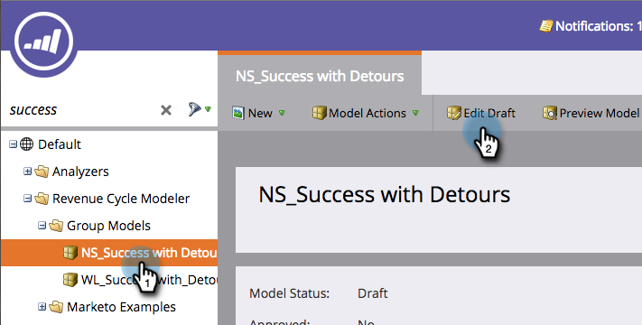

# 更改舞台名称 {#changing-the-name-of-a-stage}

改变主意了？ 没问题。 在收入周期建模器中重命名阶段很容易。

1. 转到 **Analytics** 的上界。

   

1. 选择要更新的收入周期建模器。 单击 **编辑草稿**.

   

1. 选择要更新的阶段并输入新 **名称**.

   

1. 单击&#x200B;**关闭**。

   

   看？ 放松！ 记住 [批准模型](/help/marketo/product-docs/reporting/revenue-cycle-analytics/revenue-cycle-models/approve-unapprove-a-revenue-model.md).
