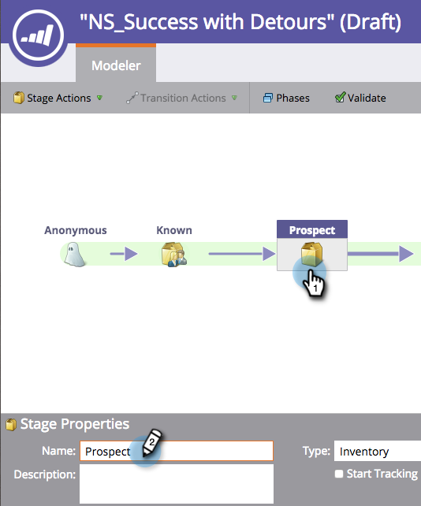
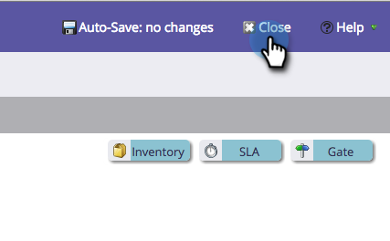

# 更改阶段名称 {#changing-the-name-of-a-stage}

改变主意？ 没问题。 重命名收入周期Modeler中的阶段很容易。

1. 进入 **[!UICONTROL Analytics]** 区域。

   

1. 选择要更新的收入周期建模器。 单击 **[!UICONTROL Edit Draft]**。

   

1. 选择要更新的阶段并输入新的&#x200B;**[!UICONTROL Name]**。

   

1. 单击 **[!UICONTROL Close]**。

   

   看到没？ 放轻松！ 请记住[批准您的模型](/help/marketo/product-docs/reporting/revenue-cycle-analytics/revenue-cycle-models/approve-unapprove-a-revenue-model.md)。
