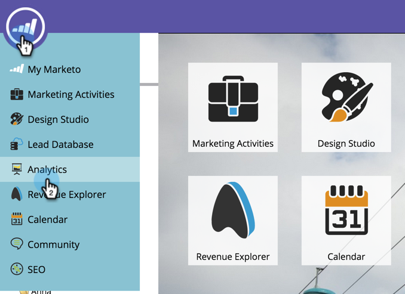

# 克隆Marketo示例收入模型 {#cloning-a-marketo-example-revenue-model}

Marketo提供了一些示例收入建模器，可帮助您获得启发。 克隆这些建模器，并将其作为您自己的建模器。 方法如下：

1. 转到 **分析** 区域。

   

1. 选择 **收入周期Modeler** 文件夹，然后单击 **Marketo示例**.

   

1. 选择其中一个建模器。

   

1. 在模型操作中，选择 **克隆模型**.

   

1. 输入 **名称** 并单击 **克隆**.

   

   要是有这么容易就好了！
