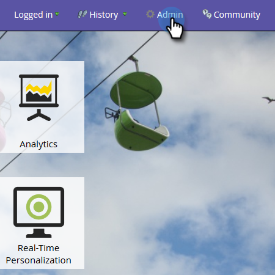

# 为模型性能分析（潜在客户）启用自定义字段组 {#enable-custom-field-groups-for-model-performance-analysis-leads}

>[!PREREQUISITES]
>
>将标准字段或自定义字段分类为组，以便通过Marketo中的Field Organizer进行报告。 有关详细信息，请参阅 [通过字段管理器创建自定义字段组](/help/marketo/product-docs/reporting/revenue-cycle-analytics/revenue-tools/field-organizers/create-custom-field-groups-using-the-field-organizer.md).

<table> 
 <tbody> 
  <tr> 
   <td colspan="3" rowspan="1">
<strong>启用自定义字段组对收入周期浏览器中的多个分析区域有何影响？</strong>
</td> 
  </tr> 
  <tr> 
   <td colspan="1" rowspan="1">
<strong>当……发生什么？</strong>
</td> 
   <td colspan="1" rowspan="1">
<strong>它如何影响模型性能分析（商机）领域</strong>
</td> 
   <td colspan="1" rowspan="1">
<strong>它对潜在客户分析、促销活动分析和机会分析领域有何影响</strong>
</td> 
  </tr> 
  <tr> 
   <td colspan="1" rowspan="1">
<strong>启用与标准潜在客户或公司字段关联的自定义字段组后会发生什么情况？</strong>
</td> 
   <td colspan="1" rowspan="1">
已启用自定义字段组，以便在模型性能分析（潜在客户）区域中进行报告
</td> 
   <td colspan="1" rowspan="1">
无影响
</td> 
  </tr> 
  <tr> 
   <td colspan="1" rowspan="1">
<strong>启用与自定义人员或公司字段关联的自定义字段组后会发生什么情况？</strong>
</td> 
   <td colspan="1" rowspan="1">
已启用自定义字段组，以便在模型性能分析（潜在客户）区域中进行报告
</td> 
   <td colspan="1" rowspan="1">
自定义字段本身已启用，可用于在“潜在客户分析”、“促销活动分析”和“机会分析”区域进行报告。

<strong>注意：</strong> 这些分析区域不支持自定义字段组，因此组关联不会显示在收入周期浏览器中 — <em>仅</em> 自定义字段。
</td> 
  </tr> 
 </tbody> 
</table>

请按照以下步骤来启用自定义字段组，以在模型性能分析（潜在客户）区域中进行报告。

1. 单击 **管理员**.

   

1. 单击 **收入周期分析**.

   

1. 单击 **无** 空字段组旁边。 如果已启用三个字段组，并且想要进行编辑，请单击要修改的字段组的名称。

   

1. 单击 **字段** 下拉菜单，然后选择您想要的。

   

   >[!NOTE]
   >
   >此示例为标准字段启用了自定义字段组（状态）。 因此，只有“模型性能分析（潜在客户）”区域受到影响。 如果为自定义人员或公司字段启用了自定义字段组，则启用的组将在“同步摘要”选项卡的“模型性能分析（潜在客户）”部分中显示，而“潜在客户”、“促销活动”和“机会分析”的自定义字段计数将增加1。

1. 单击 **保存**.

   
