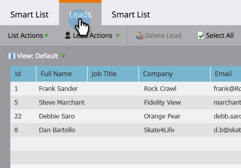

# 在收入周期模型{#find-all-leads-in-a-revenue-cycle-model}中查找所有潜在客户

通过使用智能列表，您可以轻松找到收入周期模型的所有成员。

>[!PREREQUISITES]
>
>[创建智能列表](/help/marketo/product-docs/core-marketo-concepts/smart-lists-and-static-lists/creating-a-smart-list/create-a-smart-list.md)

1. 选中智能列表后，单击&#x200B;**智能列表**&#x200B;选项卡。

   

1. 找到收入模型&#x200B;**的**&#x200B;成员过滤器，并将其拖入画布中。

   

1. 选择&#x200B;**Model**。

   

   这将使您获得该模型中的所有潜在客户，而不管是哪个阶段。 通常，您需要特定的舞台。 请改用以下筛选器。

1. 找到&#x200B;**收入阶段**&#x200B;过滤器并将其拖入画布。

   

1. 选择&#x200B;**Stage**。

   

1. 转到&#x200B;**Leads**&#x200B;选项卡以视图结果。

   

   >[!TIP]
   >
   >您不需要两个过滤器，只需选择所需的。 我们只是向你们展示，要彻底。

   >[!CAUTION]
   >
   >如果潜在客户的阶段在最初创建潜在客户时由外部活动更改，则活动不会记录在数据库中。 这意味着智能列表过滤器不会包括潜在客户。
