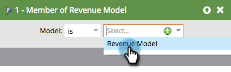

# 在收入周期模型中查找所有潜在客户 {#find-all-leads-in-a-revenue-cycle-model}

通过使用智能列表，您可以轻松找到收入周期模型的所有成员。

>[!PREREQUISITES]
>
>[创建智能列表](../../../../product-docs/core-marketo-concepts/smart-lists-and-static-lists/creating-a-smart-list/create-a-smart-list.md)

1. 选择智能列表后，单击智能 **列表选** 项卡。

   

1. 查找收 **入模型筛选器的** “成员”并将其拖入画布。

   

1. 选择一 **个模型**。

   

   这将使您获得该模型中的所有潜在客户，而不管是哪个阶段。 通常，您需要特定的阶段。 请改用以下筛选器。

1. 找到**Revenue Stage **过滤器并将其拖入画布。

   

1. 选择一 **个舞台。**

   

1. 转到Lead **选项卡** ,视图结果。

   

   >[!TIP]
   >
   >你不需要两个过滤器，只需选择所需的。 我们只是告诉你们俩要彻底。  >

   >[!CAUTION]
   >
   >如果潜在客户在初始创建期间由外部活动更改了潜在客户的阶段，则活动不会登录到数据库。 这意味着智能列表过滤器不会包含潜在客户。

