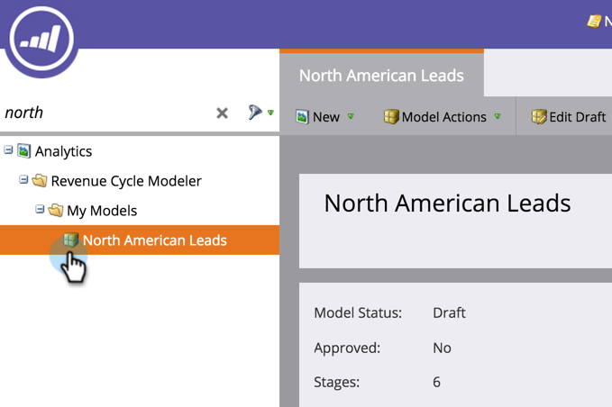
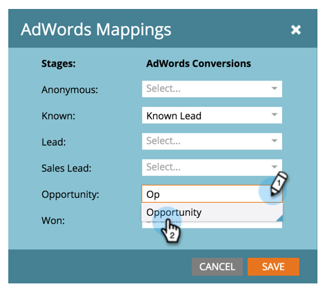

# 在收入模型中设置Google AdWords转换 {#set-google-adwords-conversions-in-the-revenue-model}

将您的Google AdWords帐户关联到Marketo，以自动将线下转换数据从Market上传到Google AdWords。 然后，在AdWords中添加自定义列后，您将能够从AdWords UI中轻松查看哪些点击产生了合格的潜在客户、机会和新客户(或要跟踪的 [任何收入阶段](https://support.google.com/adwords/answer/3073556) )。

>[!NOTE]
>
>这是从Marketo到Google AdWords的推动集成。 转换数据将 *仅在* Google AdWords门户中显示，**不会显示在Marketo UI中。 **

进一步了 [解Google的脱机转换导入功能](https://support.google.com/adwords/answer/2998031?hl=en)。  在收入模型中将AdWords脱机转换映射到一个或多个阶段。 有三种方法可执行映射：

* AdWords转换
* 舞台操作
* AdWords映射

如果您使用Stage Action，则可以从Marketo创建新的AdWords脱机转换。

>[!NOTE]
>
>**先决条件**
>
>* [将Google AdWords添加为LaunchPoint服务](../../../../product-docs/administration/additional-integrations/add-google-adwords-as-a-launchpoint-service.md)

>

## 使用AdWords转换 {#use-adwords-conversion}

1. 转至“分 **析** ”区域。

   

1. 选择模型。

   

1. 单击“ **编辑草稿**”。

   

1. 选择要映射到AdWords转换的收入阶段。

   

1. 选择 **要映射到** “营销人员”舞台的AdWords转换。

   

   不错！ 您的AdWord转换数据将按您选择的节奏上传到您的Google AdWords。

## 使用阶段操作 {#use-stage-action}

您还可以在“阶段操作”下映射AdWords转换。

1. 选择要映射到AdWords转换的步骤。

   

1. 在“阶 **段操作** ”下拉框中，选 **择“设置AdWords转换**”。

   

1. 选择一 **个AdWords转换**。

   

   **提示**:如果您没有任何AdWords转换，请单击+新建转换 **来创建一个转换**。

   

1. 单击 **保存**。

   

1. 完成所有AdWords转换到收入阶段的映射后，返回摘要页。 选择 **模型操作** ，然后选择 **批准阶段**。

   

## 专业提示：添加新转换 {#pro-tip-add-a-new-conversion}

专业提示！ 可从Marketo创建新的AdWords脱机转换。

>[!CAUTION]
>
>通过Market创建的新转换启用“优化”设置。 这意味着允许AdWords竞价策略优化您对这些转化的竞价。 您可以从AdWords帐户更改此设置。

1. 在“阶 **段操作** ”下拉框中，选 **择“设置AdWords转换**”。

   

1. 选择 **新转换**。

   

1. 输入转 **换名称**。 单击 **保存**。

   

   太棒了！ 此新转换将显示在您的AdWords帐户中。

## 使用AdWords映射 {#use-adwords-mapping}

您可以使用AdWords映射将所有模型阶段与AdWords转换关联到一个位置。

1. 选择 **编辑AdWords映射**。

   

1. 为要跟踪 **的每个阶段** ，选择所需的AdWords转换。

   

1. 映射舞台后，单击“保 **存”**。

   

1. 完成所有AdWords转换到收入阶段的映射后，返回摘要页。 选择 **模型操作** ，然后选择 **批准阶段**。

   

要视图脱机转换数据，您需要登录AdWords帐户。 我们建议您使用其自 [定义列功能](https://support.google.com/adwords/answer/3073556) ，为您从Market导入的每个脱机转换创建转换计数列。
