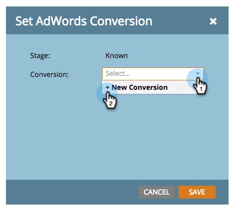

# 在收入模型中设置Google AdWords转化 {#set-google-adwords-conversions-in-the-revenue-model}

将您的Google AdWords帐户关联到Marketo，以自动将离线转化数据从Marketo上传到Google AdWords。 然后，从AdWords UI中，您将能够轻松查看哪些点击在您之后产生了符合条件的潜在客户、机会和新客户（或您希望跟踪的任何收入阶段） [添加自定义列](https://support.google.com/adwords/answer/3073556) 在AdWords中。

>[!NOTE]
>
>这是从Marketo到Google AdWords的推送集成。 将显示转化数据 _仅限_ 在Google AdWords门户中， _不在Marketo UI中_.

了解有关 [Google的脱机转换导入功能](https://support.google.com/adwords/answer/2998031?hl=en). 将AdWords离线转化映射到收入模型的一个或多个阶段。 有三种方法可执行映射：

* AdWords转换
* 暂存操作
* AdWords映射

如果您使用暂存操作，则可以从Marketo创建新的AdWords离线转化。

>[!PREREQUISITES]
>
>[将Google AdWords添加为LaunchPoint服务](/help/marketo/product-docs/administration/additional-integrations/add-google-adwords-as-a-launchpoint-service.md)

## 使用AdWords转换 {#use-adwords-conversion}

1. 转到 **分析** 区域。

   

1. 选择模型。

   

1. 单击 **编辑草稿**.

   

1. 选择要映射到AdWords转换的收入阶段。

   

1. 选择 **AdWords转换** 您希望映射到您的Marketo舞台。

   

   太好了！ 您的AdWords转化数据将以您选择的节奏上传到Google AdWords。

## 使用暂存操作 {#use-stage-action}

您还可以在“暂存操作”下映射AdWords转换。

1. 选择要映射到AdWords转换的步骤。

   

1. 在 **暂存操作** 下拉列表，选择 **设置AdWords转换**.

   

1. 选择 **AdWords转换**.

   

   **提示**：如果您没有任何AdWords转换，请单击 **+新建转换**.

   

1. 单击 **保存**.

   

1. 完成将所有AdWords转化映射到收入阶段后，返回摘要页面。 选择 **模型操作** 并选择 **批准阶段**.

   

## 专业提示：添加新转化 {#pro-tip-add-a-new-conversion}

专业提示！ 可以从Marketo创建新的AdWords离线转化。

>[!CAUTION]
>
>从Marketo创建的新转化启用了“优化”设置。 这意味着允许AdWords竞价策略优化您对这些转化的竞价。 您可以通过AdWords帐户更改此设置。

1. 在 **暂存操作** 下拉列表，选择 **设置AdWords转换**.

   

1. 选择 **新建转换**.

   

1. 输入 **转化名称**. 单击 **保存**.

   

   太棒了！ 此新转化将显示在您的AdWords帐户中。

## 使用AdWords映射 {#use-adwords-mapping}

您可以使用AdWords映射将所有模型阶段与AdWords转换关联到一个位置。

1. 选择 **编辑AdWords映射**.

   

1. 选择所需的 **AdWords转换** 跟踪的每个阶段。

   

1. 映射阶段后，单击 **保存**.

   

1. 完成将所有AdWords转化映射到收入阶段后，返回摘要页面。 选择 **模型操作** 并选择 **批准阶段**.

   

要查看离线转化数据，您需要登录AdWords帐户。 我们建议您使用 [自定义列功能](https://support.google.com/adwords/answer/3073556) 要为从Marketo导入的每个离线转化创建转化计数列。
