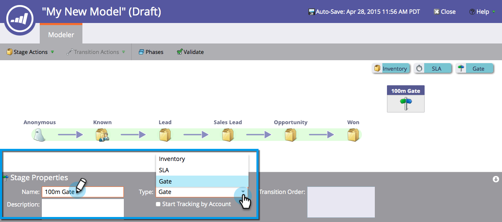
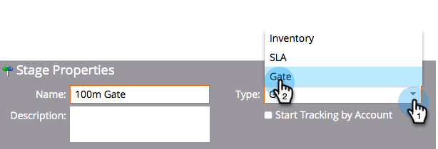

# 使用收入模型审核阶段 {#using-revenue-model-gate-stages}

审核阶段用作资格检查。

>[!TIP]
>
>最好在图形或演示程序中创建一个实践模型，并与同事确认。

## 添加关口阶段 {#add-a-gate-stage}

1. 转到 **分析** 区域。

   

1. 选择现有模型，或 [新建一个](/help/marketo/product-docs/reporting/revenue-cycle-analytics/revenue-cycle-models/create-a-new-revenue-model.md).

   

1. 单击 **编辑草稿**.

   

1. 单击 **Gate** 按钮，然后拖放到画布中的任意位置。

   

1. 编辑 **名称** 并选择 **类型**.

   >[!NOTE]
   >
   >选择 [开始按帐户跟踪](/help/marketo/product-docs/reporting/revenue-cycle-analytics/revenue-cycle-models/start-tracking-by-account-in-the-revenue-modeler.md) 此时，可以深入了解客户在模型中的表现。

   

>[!NOTE]
>
>“关卡阶段”会根据您在过渡规则中输入的条件拆分潜在客户； **它没有潜在客户**. 需要默认过渡，以便其他过渡未选择的潜在客户最终通过默认过渡。

## 编辑审核阶段 {#edit-a-gate-stage}

编辑“名称”、“描述”并调整“关卡”阶段的“类型”。 您还可以选择 [开始按帐户跟踪](/help/marketo/product-docs/reporting/revenue-cycle-analytics/revenue-cycle-models/start-tracking-by-account-in-the-revenue-modeler.md).

1. 单击 **Gate** 舞台图标。

   

1. 在 **名称** 和 **描述** 字段以编辑其内容。

   

1. 选择 **类型** 下拉菜单进行编辑。

   

## 删除审核阶段 {#delete-a-gate-stage}

1. 可以通过右键单击关机阶段图标并选择 **删除**.

   

1. 也可以通过单击某个关卡阶段，然后在 **暂存操作** 下拉列表，选择 **删除**.

   

1. 这两种删除方法都会要求您确认自己的选择。 单击 **删除**.

   

恭喜！ 现在你了解了《门舞台》的精彩世界。

>[!MORELIKETHIS]
>
>* [使用收入模型库存阶段](/help/marketo/product-docs/reporting/revenue-cycle-analytics/revenue-cycle-models/using-revenue-model-inventory-stages.md)
>* [使用收入模型SLA阶段](/help/marketo/product-docs/reporting/revenue-cycle-analytics/revenue-cycle-models/using-revenue-model-sla-stages.md)
>* [创建新的收入模型](/help/marketo/product-docs/reporting/revenue-cycle-analytics/revenue-cycle-models/create-a-new-revenue-model.md).
