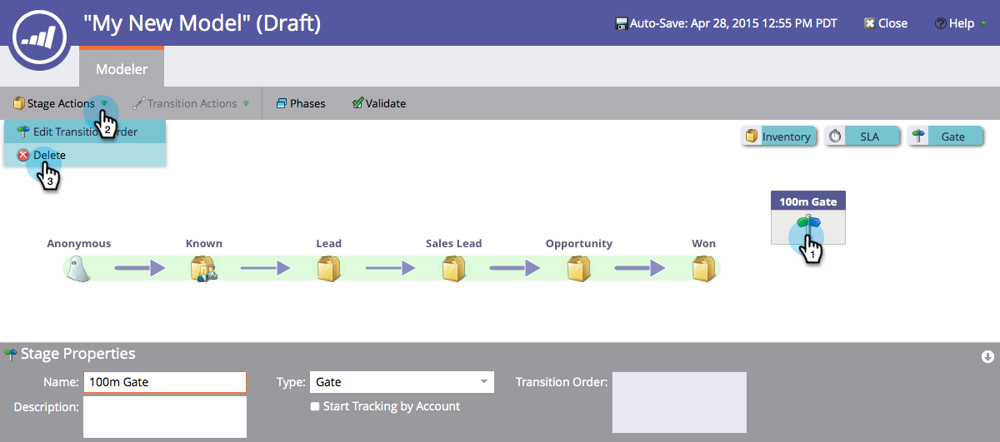

# 使用收入模型入口阶段{#using-revenue-model-gate-stages}

门级作为资格检查。

>[!TIP]
>
>最好在图形或演示文稿项目中创建练习模型并与同事确认。

## 添加A门级{#add-a-gate-stage}

1. 转至&#x200B;**Analytics**&#x200B;区域。

   

1. 选择现有模型，或者[创建新模型](/help/marketo/product-docs/reporting/revenue-cycle-analytics/revenue-cycle-models/create-a-new-revenue-model.md)。

   

1. 单击&#x200B;**编辑草稿**。

   

1. 单击&#x200B;**Gate**&#x200B;按钮，然后拖放到画布中的任意位置。

   

1. 编辑&#x200B;**名称**&#x200B;并选择&#x200B;**类型**。

   >[!NOTE]
   >
   >此时选择[按帐户跟踪开始](/help/marketo/product-docs/reporting/revenue-cycle-analytics/revenue-cycle-models/start-tracking-by-account-in-the-revenue-modeler.md)，以了解在您的模型中运行帐户时帐户的性能。

   

>[!NOTE]
>
>门级会根据您在过渡规则中输入的条件拆分潜在客户；**它不包含lead**。 默认过渡是必需的，这样其他过渡未选择的潜在客户最终将进入默认状态。

## 编辑Gate Stage {#edit-a-gate-stage}

编辑“名称”、“说明”，并调整“门”级的“类型”。 您还可以选择[帐户开始跟踪](/help/marketo/product-docs/reporting/revenue-cycle-analytics/revenue-cycle-models/start-tracking-by-account-in-the-revenue-modeler.md)。

1. 单击&#x200B;**Gate**&#x200B;舞台图标。

   

1. 在&#x200B;**名称**&#x200B;和&#x200B;**说明**&#x200B;字段中单击以编辑其内容。

   

1. 选择&#x200B;**类型**&#x200B;下拉列表进行编辑。

   

## 删除A门级{#delete-a-gate-stage}

1. 可以通过右键单击“门”级图标并选择&#x200B;**删除**&#x200B;来删除“门”级。

   

1. 您也可以通过单击来删除Gate阶段，然后在&#x200B;**Stage Actions**&#x200B;下拉列表中选择&#x200B;**Delete**。

   

1. 这两种删除方法都要求您确认您的选择。 单击&#x200B;**删除**。

   

恭喜！ 现在你了解了门舞的美妙世界。

>[!MORELIKETHIS]
>
>* [使用收入模型库存阶段](/help/marketo/product-docs/reporting/revenue-cycle-analytics/revenue-cycle-models/using-revenue-model-inventory-stages.md)
>* [使用收入模型SLA阶段](/help/marketo/product-docs/reporting/revenue-cycle-analytics/revenue-cycle-models/using-revenue-model-sla-stages.md)
>* [创建新的收入模型](/help/marketo/product-docs/reporting/revenue-cycle-analytics/revenue-cycle-models/create-a-new-revenue-model.md)。

