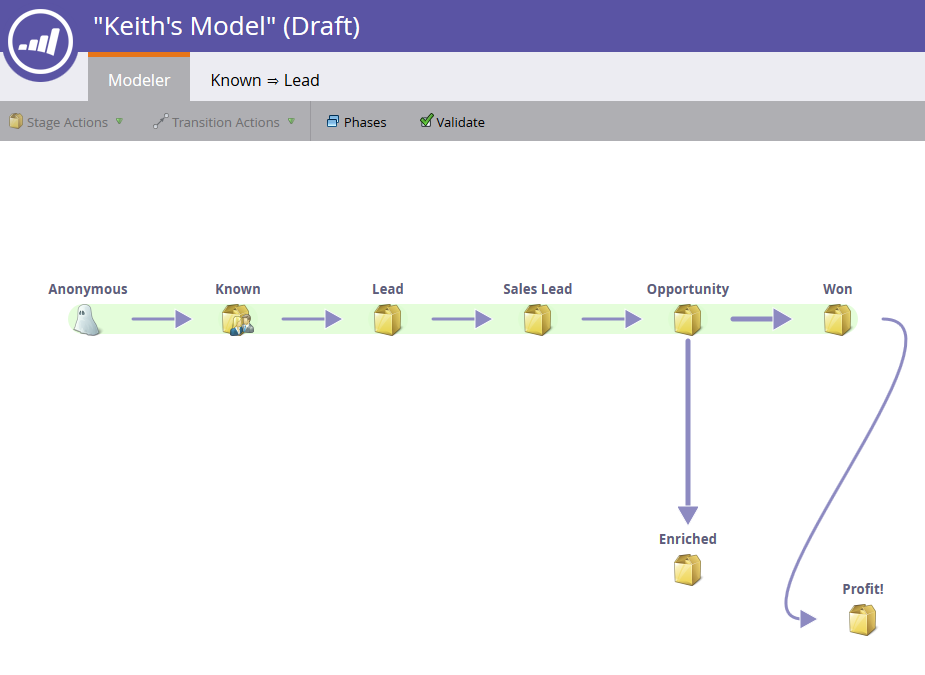

# 使用收入模型过渡 {#using-revenue-model-transitions}

>[!PREREQUISITES]
>
>[创建新的收入模型](create-a-new-revenue-model.md)

创建模型并选择和组织库存阶段时，是时候设置过渡了。

1. 右键单击(也可以按住多次单击)其中一个箭头开始，然后选择“编辑 **过渡”**。

   

   >[!NOTE]
   >
   >“匿名已知”过渡规则无法编辑。

1. 将为您选择的过渡打开一个新选项卡。   
1. 过渡控制潜在客户在不同阶段之间的移动方式。 将您选择的触发器（或过滤器）从右侧拖动，并随时随地释放到画布上。 在此示例中，我们将选择“填充表单”触发器。

   >[!TIP]
   >
   >由于收入建模器正在设置报告，因此建议过渡始终包含触发器。 这样，您的报表将反映模型／级流的真实速度。 过滤器可以与触发器一起添加，以获得其他约束。

   

1. 为所选触发器／过滤器选择参数。

   

1. 要返回模型，请单击“建模 **器”**。

   

1. 现在您将在屏幕底部看到过渡规则。

   

1. 为所有过渡配置规则后，单击验 **证** 以验证。

   

1. 如果操作正确，您将看到以下消息。

   

干得好！ 您已成功修改模型过渡。

>[!NOTE]
>
>**相关文章**
>
>[批准／取消批准收入模型](approve-unapprove-a-revenue-model.md)
