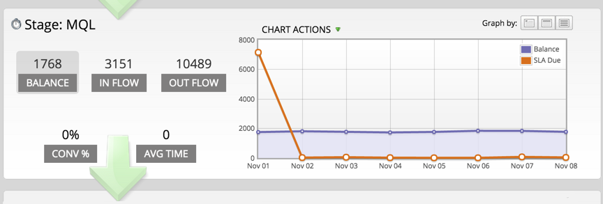

# 使用成功路径分析器 {#using-the-success-path-analyzer}

使用成功路径分析器探索可反映人员在整个过程中的流量（数量）和速度（速度，以天为单位）的特定详细信息 [收入周期模型](/help/marketo/product-docs/reporting/revenue-cycle-analytics/revenue-cycle-models/understanding-revenue-models.md).

>[!PREREQUISITES]
>
>[创建成功路径分析器](/help/marketo/product-docs/reporting/revenue-cycle-analytics/revenue-cycle-models/create-a-success-path-analyzer.md)

1. 转到 **分析** 并选择您的 **成功路径分析器**.

   

   右侧的图表反映了左侧选定按钮中的数据。 默认情况下，这是Balance。

1. 单击 **流量** 绘制在选定时间范围内进入舞台的人数的图表。

   

   * 单击出流量以绘制退出阶段的人数图表。
   * 单击Conv %绘制此阶段到下一阶段的转化率图表。
   * 单击平均时间，以查看用户在进入下一阶段之前在此阶段停留的时间。

1. 单击 **图表操作** >比较时段，将数据与具有相同长度的不同时间段进行比较。

   

1. 选择 **从** 比较期间的日期。

   

   此 **至** 日期会自动设置为与原始时间段的长度匹配。

1. 单击 **比较**.

   

1. 图表以绿色更新比较期间的重叠数据。

   

1. 要更改图表的时间范围，请单击 **图形绘制方式** 按钮：每日（默认）、每周和每月

   

1. 对于具有SLA （服务级别协议）的阶段，单击 **图表操作** > **显示SLA截止日期** 显示在指定时间段内未达到SLA目标的每个人。

   

1. 图表将进行更新，以反映每个节点上到期的SLA数量（橙色）。

   

   橙色显示的人可能 *也可能不会* 仍然处于SLA阶段。

1. 单击 **图表操作** > **显示SLA过期日期** 显示在指定时间段结束时仍处于SLA阶段的所有具有过期SLA目标的人员。

   

1. 图表将进行更新，以反映每个节点上过期的SLA数量（橙色）。

   

1. 要读取特定节点（日期）上数据点的特定详细信息，请将鼠标悬停在气泡上。

   

1. 要打印图表，请单击 **图表操作** > **打印图表**.

   

分析器可以帮助您了解模型中的移动情况。 随着您的技术不断进步，这对于制定营销策略将变得非常重要。
