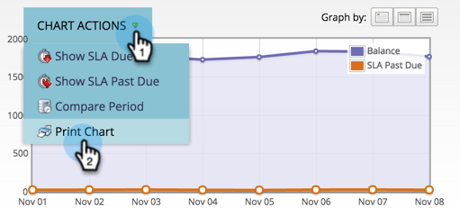

# 使用成功路径分析器{#using-the-success-path-analyzer}

使用成功路径分析器来探索反映[收入周期模型](understanding-revenue-models.md)各个阶段人员的流量（数量）和速度（速度，以天为单位）的特定详细信息。

>[!PREREQUISITES]
>
>[创建成功路径分析器](create-a-success-path-analyzer.md)

1. 转至&#x200B;**Analytics**&#x200B;并选择&#x200B;**成功路径分析器**。

   

   右侧的图表反映了左侧选定按钮中的数据。 默认情况下，这是余额。

1. 单击“在流中”**以绘制选定时间段内进入舞台的人数。**

   

   * 单击“退出流”以绘制退出舞台的人数。
   * 单击“控制百分比”，将转化率从此图表化到下一阶段。
   * 单击“平均时间”以查看在进入下一个阶段之前在此阶段所花费的时间。

1. 单击&#x200B;**图表操作** >比较时段，将数据与长度相等的不同时间帧进行比较。

   

1. 为比较期间选择&#x200B;**开始日期**。

   

   **To**&#x200B;日期会自动设置为与原始时间段的长度匹配。

1. 单击&#x200B;**比较**。

   

1. 图表以绿色显示比较时段的重叠数据更新。

   

1. 要更改图表的时间刻度，请单击&#x200B;**Graph by**&#x200B;按钮之一：每日（默认）、每周和每月

   

1. 对于具有SLA（服务级别协议）的阶段，单击&#x200B;**图表操作**>**显示SLA到期情况**，以显示在指定时间范围内错过SLA目标的每个人。

   

1. 图表更新以反映每个节点应满足的SLA数（橙色）。

   

   橙色显示的人可能&#x200B;*或者可能不*&#x200B;仍处于SLA阶段。

1. 单击&#x200B;**图表操作**>**显示SLA过期***，以显示在指定时间段结束时仍处于SLA阶段的所有SLA目标过期的人员。

   

1. 图表将更新，以反映每个节点上逾期的SLA（橙色）。

   

1. 要读取特定节点（日期）上数据点的特定详细信息，请将鼠标悬停在气泡上方。

   

1. 要打印图表，请单击** ****图表操作** > **打印图表**。

   

此处的分析器可帮助您了解模型中的运动。 随着您的进步，这将成为制定营销工作战略的重要工具。
