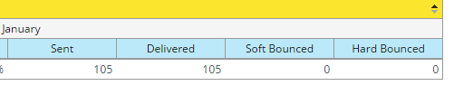

# 向收入浏览器报表{#adding-custom-measures-to-a-revenue-explorer-report}添加自定义度量

有时，您希望报表中包含自定义度量。 创建您自己的应用程序很容易。

在以下示例中，您将为软弹回次数创建一个计算度量，该度量采用报表中已有的度量并使用基本数学创建新度量。 您也可以创建其他类型的度量。

>[!PREREQUISITES]
>
>您的报表中至少需要一个度量，但它不一定是用于定义自定义度量的度量之一。

1. 调出报告所需的字段。 有关详细信息，请参阅[向收入浏览器报表添加字段](adding-fields-to-a-revenue-explorer-report.md)。
1. 右键单击现有度量（蓝色单元格），单击&#x200B;**用户定义度量**&#x200B;并选择&#x200B;**计算度量**。

   

1. 命名自定义度量并选择一种格式。

   

1. 单击左侧需要的每个项目，然后单击箭头以将其移过。 根据需要添加数学符号。

   

   >[!TIP]
   >
   >您可以自己键入数学符号或使用选择框。

1. 完成后，单击&#x200B;**确定**。

   

   您的新自定义度量将作为新列显示在报告中。

   

   >[!NOTE]
   >
   >**相关文章**
   >
   >    
   >    
   >    * [将字段添加到收入浏览器报表](adding-fields-to-a-revenue-explorer-report.md)

