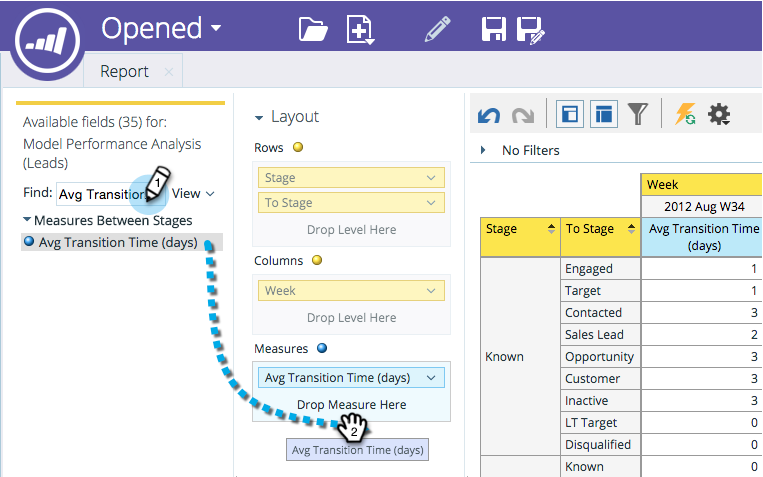

# 将字段添加到收入资源管理器报表 {#adding-fields-to-a-revenue-explorer-report}

通过将维度和量度字段拖放到画布中来自定义收入资源管理器报表。

<table> 
 <tbody> 
  <tr> 
   <th>字段类型</th> 
   <th>描述</th> 
  </tr> 
  <tr> 
   <td>黄色字段或Dimension</td> 
   <td>
黄色字段是报表的维度（行和列）。

例如，您可以设置一个报表，以列显示您的潜在客户状态或创建日期。
</td> 
  </tr> 
  <tr> 
   <td>蓝色字段或测量值</td> 
   <td>
蓝色字段是在数据中分析的量度。

例如，这可以是潜在客户的平均潜在客户得分，也可以是潜在客户拥有商机的天数。
</td> 
  </tr> 
 </tbody> 
</table>

1. 找到要使用的黄色字段并将其拖到行中。

   

   >[!TIP]
   >
   >将鼠标悬停在字段上可查看完整说明。

1. 找到要使用的蓝色字段并将其拖到测量中。

   

   太棒了！ 现在您拥有了完整的报告！

   

>[!MORELIKETHIS]
>
>[删除收入浏览器报表中的字段](/help/marketo/product-docs/reporting/revenue-cycle-analytics/revenue-explorer/deleting-a-field-in-a-revenue-explorer-report.md)
