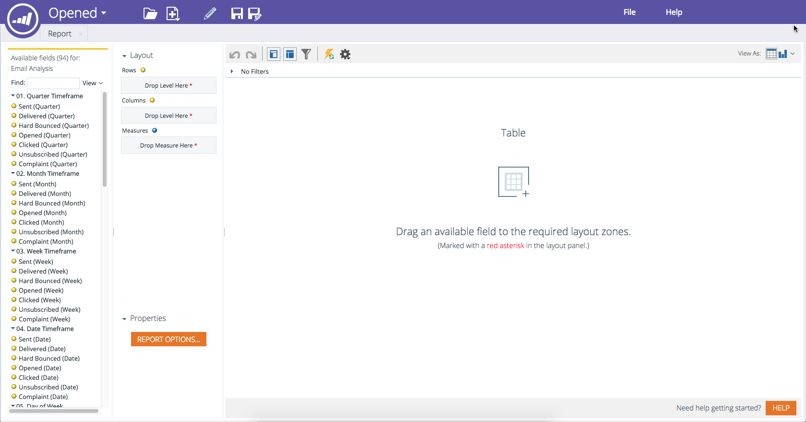

# 创建收入浏览器报表 {#create-a-revenue-explorer-report}

Revenue Explorer报表允许您跟踪营销计划的ROI。

>[!AVAILABILITY]
>
>并非所有Marketo Engage用户都已购买此功能。 有关详细信息，请联系Adobe客户团队（您的客户经理）。

>[!IMPORTANT]
>
>由于技术问题，收入循环资源管理器中的垃圾桶文件夹已暂时隐藏。 我们目前正在修复此问题，您的文件是安全的。 如果有任何文件需要还原，请联系[Adobe支持](https://nation.marketo.com/t5/support/ct-p/Support)。

1. 转到&#x200B;**收入资源管理器**&#x200B;区域。

   

1. 单击&#x200B;**新建**，然后选择&#x200B;**报告**。

   

1. 选择报表类型。

   

   太棒了！ 您已正式创建报告。 通过添加某些字段进行自定义的时间！

   

>[!MORELIKETHIS]
>
>[将字段添加到收入资源管理器报表](/help/marketo/product-docs/reporting/revenue-cycle-analytics/revenue-explorer/adding-fields-to-a-revenue-explorer-report.md)
>[将自定义度量添加到收入资源管理器报表](/help/marketo/product-docs/reporting/revenue-cycle-analytics/revenue-explorer/adding-custom-measures-to-a-revenue-explorer-report.md)
