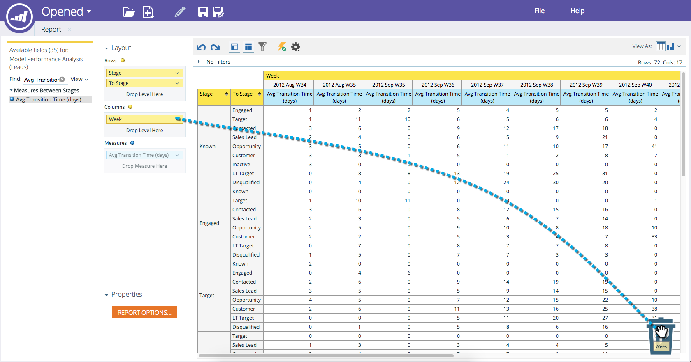

# 删除收入浏览器报表中的字段 {#deleting-a-field-in-a-revenue-explorer-report}

有时，您可能会将错误的字段拖入报表中。 以下是删除方法：

1. 将要删除的字段拖到 **垃圾桶** 图标（位于报表的右下方）。

   

   >[!NOTE]
   >
   >在开始拖动字段之前，垃圾桶处于隐藏状态。

>[!MORELIKETHIS]
>
>[保存收入浏览器报表](/help/marketo/product-docs/reporting/revenue-cycle-analytics/revenue-explorer/saving-a-revenue-explorer-report.md)
