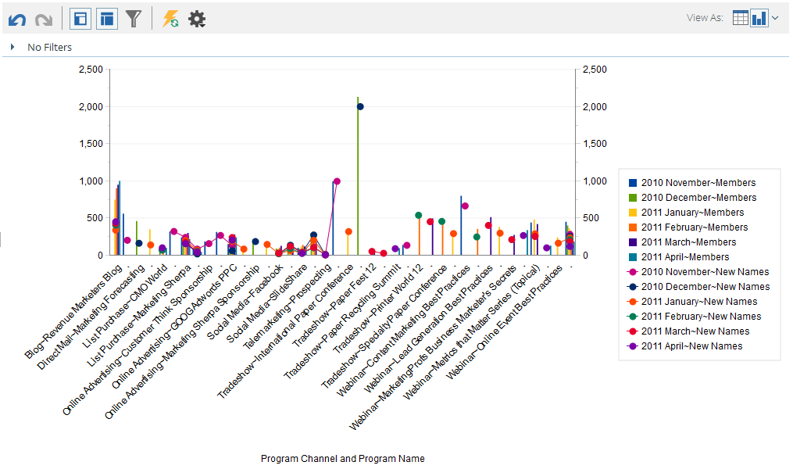
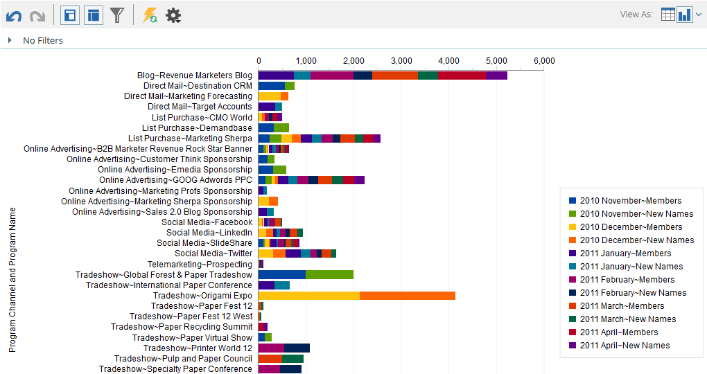

# 从收入浏览器{#graphing-results-from-revenue-explorer}绘制结果图

默认情况下，收入浏览器中的报表显示为表。 您还可以选择以各种格式的图形形式显示结果。

1. 单击报表的&#x200B;**“视图为**”下拉菜单中的箭头。 将显示不同的图形选项。

   

## 图表示例{#graph-examples}

**列**:表中的每行和每列都显示为垂直列。

**堆叠列**:表中的每一行在图表中都有一列。

**100%堆叠列**:表中的每行在图形中都有一列，并将其缩放为100%。

**行**:每列均显示为一行，每行均显示为该行上的数据点。

**列行组合**:列和折线图的组合。

**栏**:表中的每行和每列都显示为水平条。

**堆叠条**:表中的每一行在图表中都有一行。

**100%堆叠条**:表中的每行在图形中都有一行，并会缩放到100%。

**区域**:显示的数据与堆叠条类似，但已填写。

**饼图**:每列显示为饼图，每行显示为切片。

**Sunburst**:表示切片中属性的径向图。

**散点**:基于所使用属性的冒泡。使用测量对气泡进行颜色编码和/或确定其大小。

**热网**:自定义颜色和形状以识别正反性能模式。

1. 要切换回表视图，请单击表按钮。

   
