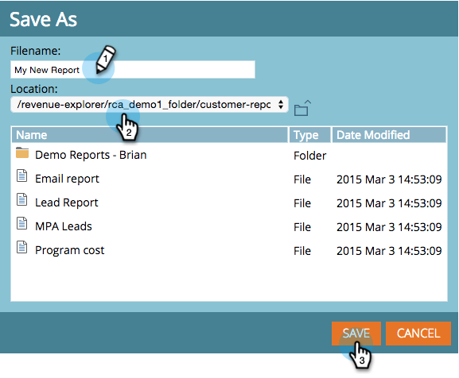

# 保存收入浏览器报表 {#saving-a-revenue-explorer-report}

可以将收入资源管理器报表保存到您选择的文件中。

1. 单击保存图标。

   

   >[!NOTE]
   >
   >您对报表所做的更改不会自动保存。 所以一定要经常省钱！

1. 为您的报表提供一个描述性名称，选择一个位置，然后单击 **保存**!

   

   仅此而已！ 您现在可以在 **浏览文件**.

   

>[!MORELIKETHIS]
>
>[订阅收入浏览器报表](/help/marketo/product-docs/reporting/revenue-cycle-analytics/revenue-explorer/subscribe-to-a-revenue-explorer-report.md)
