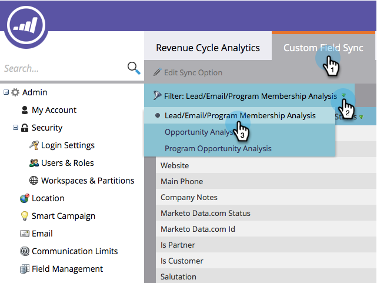

# 将自定义字段同步到收入资源管理器 {#sync-custom-fields-to-the-revenue-explorer}

收入周期Analytics可以报告自定义Marketo字段，为此，您需要设置要同步的自定义字段。

>[!NOTE]
>
>**需要管理员权限**

1. 转到 **管理员** 中。

   

1. 选择 **收入周期分析**.

   

1. 单击 **自定义字段同步** 选项卡，然后选取所选的分析区域。

   

1. 选择要为其启用同步的字段，然后单击 **编辑同步选项**.

   

1. 更改 **同步状态** to **已启用**.

   

1. 选择 **RCA类型** ，然后单击 **保存**.

   

   >[!TIP]
   >
   >启用后，该数据将在次日在收入周期分析中可用。

   干得好！ 现在您知道如何向RCA添加自定义字段。
