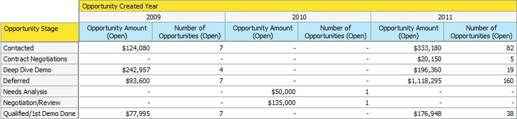

# 了解Revenue Explorer中的机会分析 {#understanding-opportunity-analysis-in-revenue-explorer}

收入浏览器中的机会分析允许您在更深的级别检查机会。 根据任何潜在客户/公司属性（如潜在客户来源、行业或地理位置）对数据进行切片和细分。 根据名称、阶段或概率分析机会的创建和关闭。 了解对管道的营销贡献。

## 示例分析 {#example-analysis}

以下是可以在“机会分析”区域创建的一些报表。

1. 营销对机会创造的影响

   您的营销计划对贵公司的销售渠道的影响百分比是多少？ 这份报告给你答案。 以下饼图显示了营销计划获得的所有机会数量的百分比和机会金额。

   

1. 对机会的营销影响已结束并赢得。

   此报表按数量和金额显示了多少收入被获取并受营销影响。

   

1. 由潜在客户来源关闭的机会

   此报表可划分按潜在客户来源关闭的所有机会，并为您提供有关哪些来源有效以及哪些来源无效的清晰概述。

   

1. 按源关闭时间

   此报表显示了关闭机会的平均天数与潜在客户来源之间的关系。

   

1. Open Opportunity and Stage

   此报表显示每个收入周期阶段中打开的机会数。

   

1. 按行业划分的机会数量

   该报告回答了以下问题：“我们从某些行业获得的机会是否逐年增加？”

   

## 机会分析Dimension和措施 {#opportunity-analysis-dimensions-and-measures}

Opportunity Analysis使您能够访问所有与潜在客户、公司和机会相关的维度以及与机会相关的度量。 使用这些机会分析维度和量度来回答报表中的特定问题。

1. 公司属性

   | 维度 | 描述 |
   |---|---|
   | 年收入 | 公司的年收入 |
   | 城市 | 公司所在的城市 |
   | 国家 | 公司所在的县 |
   | 行业 | 公司所处的行业 |
   | 公司名称 | 公司名称 |
   | 员工数量 | 公司雇员人数 |
   | 邮政编码 | 公司的邮政编码 |
   | SIC 代码 | 公司SIC代码 |
   | 州 | 公司所在的州 |

1. 潜在客户属性

   | 维度 | 描述 |
   |---|---|
   | 列入阻止列表 | 潜在客户已列入阻止列表 |
   | 已转换为Opportunity | 潜在客户被转换为机会 |
   | 电子邮件无效 | 潜在客户是否具有有效的电子邮件地址 |
   | 营销暂停 | 潜在客户是否在营销电子邮件中暂停 |
   | 电子邮件地址 | 潜在客户的电子邮件地址 |
   | 职务 | 领导职务 |
   | 全名 | Lead的全名 |
   | 原始源类型 | 潜在客户的原始源类型 |
   | 注册源类型 | 潜在客户的注册来源类型 |
   | 潜在客户所有者电子邮件地址 | 潜在客户所有者的电子邮件地址 |
   | 潜在客户所有者职务 | 潜在客户所有者的职务 |
   | 潜在客户所有者名称 | 潜在客户所有者的名称 |
   | 潜在客户来源 | 潜在客户来源 |
   | 潜在客户状态 | 潜在客户状态 |

1. 潜在客户创建时间范围

   | 维度 | 描述 |
   |---|---|
   | 商机创建年份 | 创建潜在客户的年份 |
   | 商机创建季度 | 创建潜在客户的季度 |
   | 潜在客户创建月份 | 创建潜在客户的月份 |
   | 商机创建周 | 创建潜在客户的周 |
   | 潜在客户创建日期 | 创建潜在客户的日期 |

1. 机会属性

   | 维度 | 描述 |
   |---|---|
   | 机会已结束 | 机会是否已经结束 |
   | 机会预测类别 | 机会预测类别 |
   | 机会名称 | 机会名称 |
   | 机会阶段 | 机会阶段 |
   | 机会类型 | 机会类型 |
   | 机会赢 | 这个机会是否已经结束，并且赢得了 |
   | 影响营销的机会 | 此标记指示任何潜在客户/联系人是否已通过任何营销计划获得或成功。 只考虑定义了期间费用的方案。 |

1. 机会结束时间范围

   | 维度 | 描述 |
   |---|---|
   | 机会结束年份 | 机会关闭的年份 |
   | 销售机会结束季度 | 机会关闭的季度 |
   | 机会结束月份 | 机会关闭的月份 |
   | 机会结束周 | 机会关闭的一周 |
   | 机会结束日期 | 机会关闭的日期 |

1. 机会创建的时间范围

   | 维度 | 描述 |
   |---|---|
   | 机会创建年份 | 创建机会的年份 |
   | 机会创建季度 | 创建机会的季度 |
   | 机会创建月份 | 创建机会的月份 |
   | 机会创建周 | 创建机会的周 |
   | 机会创建日期 | 创建机会的日期 |

1. 测量

   | 测量 | 描述 |
   |---|---|
   | 关闭机会的平均天数 | 关闭机会的平均天数 |
   | 关闭机会的平均天数（丢失） | 丢失机会的平均天数 |
   | 关闭机会的平均天数（韩元） | 成功机会的平均天数 |
   | 所有机会的数量 | 所有机会的总数 |
   | 机会数（已关闭） | 已关闭（赢得或丢失）的机会总数 |
   | 机会数（丢失） | 丢失的机会总数 |
   | 机会数量（开放） | 仍在打开的机会总数 |
   | 机会数量（韩元） | 已赢得的机会总数 |
   | 机会金额 | 总机会金额。 如果多个潜在客户与一个机会关联，则分配金额将基于潜在客户分数。 |
   | 机会金额（丢失） | 损失的机会的总金额。 如果多个潜在客户与一个机会关联，则分配金额将基于潜在客户分数。 |
   | 机会金额（打开） | 未结业务机会的总金额。 如果多个潜在客户与一个机会关联，则分配金额将基于潜在客户分数。 |
   | 机会金额（韩元） | 已赢得的机会的总金额。 如果多个潜在客户与一个机会关联，则分配金额将基于潜在客户分数。 |

>[!MORELIKETHIS]
>
>* [创建收入浏览器报表](/help/marketo/product-docs/reporting/revenue-cycle-analytics/revenue-explorer/create-a-revenue-explorer-report.md)
>* [向收入浏览器报表添加字段](/help/marketo/product-docs/reporting/revenue-cycle-analytics/revenue-explorer/adding-fields-to-a-revenue-explorer-report.md)
>* [订阅收入浏览器报表](/help/marketo/product-docs/reporting/revenue-cycle-analytics/revenue-explorer/subscribe-to-a-revenue-explorer-report.md)

