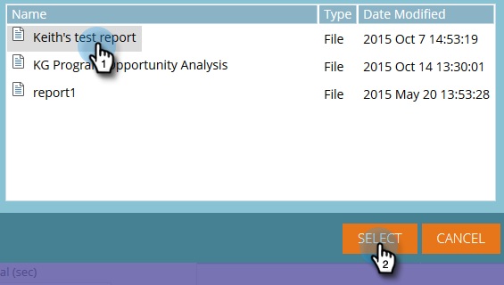

# 在Revenue Explorer中使用功能板 {#using-dashboards-in-revenue-explorer}

功能板是Revenue Explorer报表的组合，用于快速大致了解您的潜在客户、促销活动、机会和/或模型。

## 创建新功能板 {#creating-a-new-dashboard}

1. 单击 **Revenue Explorer**.

   

1. 单击 **新建**，则 **仪表板**.

   

1. 默认情况下，将选择页面底部的“模板”。 单击要使用的布局。 此处使用了“2列”。

   

   >[!NOTE]
   >
   >通过单击，可以进一步自定义仪表板的外观 **主题** 选择你的最爱。

1. 在功能板的第一部分中，单击 **插入** 图标并选择 **文件**.

   

1. 双击 **Revenue Explorer**.

   

1. 双击 **所有报告和仪表板**.

   

1. 双击存放要使用的报告的文件夹。

   

1. 选择您的报表，然后单击 **选择**.

   

1. 随后将填充该报表。 对每个剩余部分重复步骤4 - 8。

   

1. 要重命名分区，请单击该分区以将其选中，在“标题”下键入所需的名称，然后单击 **应用**. 对每个部分重复执行上述步骤。

   

1. 要保存，请单击“保存”图标，输入文件名，双击Revenue Explorer文件夹，直到转到仪表板所需的文件夹，然后单击 **保存**.

   

## 编辑功能板 {#editing-a-dashboard}

1. 单击 **Revenue Explorer**.

   

1. 双击 **Revenue Explorer** 文件夹。 导航到仪表板所在的位置。

   

1. 选择要编辑的仪表板，然后单击 **编辑**.

   

## 删除功能板 {#deleting-a-dashboard}

1. 单击 **Revenue Explorer**.

   

1. 双击 **Revenue Explorer** 文件夹。 导航到仪表板所在的位置。

   

1. 选择要删除的信息板，然后单击 **移至垃圾桶**.

   
