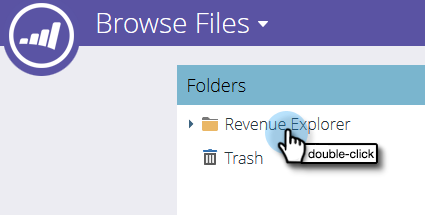

# 在[!UICONTROL Revenue Explorer]中使用仪表板 {#using-dashboards-in-revenue-explorer}

功能板由[!UICONTROL Revenue Explorer]个报表组成，可快速大致了解您的潜在客户、营销策划、机会和/或模型。

## 创建新仪表板 {#creating-a-new-dashboard}

1. 单击 **[!UICONTROL Revenue Explorer]**。

   

1. 单击&#x200B;**[!UICONTROL Create New]**，然后单击&#x200B;**[!UICONTROL Dashboard]**。

   

1. 默认情况下，将选择页面底部的“模板”。 单击要使用的布局。 此处使用“2列”。

   

   >[!NOTE]
   >
   >您可以通过单击&#x200B;**[!UICONTROL Themes]**&#x200B;并选择收藏来进一步自定义仪表板的外观。

1. 在仪表板的第一部分中，单击&#x200B;**插入**&#x200B;图标并选择&#x200B;**[!UICONTROL File]**。

   

1. 双击&#x200B;**[!UICONTROL Revenue Explorer]**。

   

1. 双击&#x200B;**[!UICONTROL All Reports and Dashboards]**。

   

1. 双击存放要使用的报告的文件夹。

   

1. 选择您的报告并单击&#x200B;**[!UICONTROL Select]**。

   

1. 随后将填充报表。 对每个剩余部分重复步骤4 - 8。

   

1. 若要重命名分区，请单击该分区以将其选中，在&#x200B;**[!UICONTROL Title]**&#x200B;下键入所需的名称，然后单击&#x200B;**[!UICONTROL Apply]**。 对每个部分重复执行上述步骤。

   

1. 要保存，请单击[!UICONTROL Save]图标，输入[!UICONTROL Filename]，双击[!UICONTROL Revenue Explorer]文件夹，直到您转到仪表板所需的文件夹，然后单击&#x200B;**[!UICONTROL Save]**。

   

## 编辑功能板 {#editing-a-dashboard}

1. 单击 **[!UICONTROL Revenue Explorer]**。

   

1. 双击&#x200B;**[!UICONTROL Revenue Explorer]**&#x200B;文件夹。 导航到功能板所在的位置。

   

1. 选择要编辑的信息板，然后单击&#x200B;**[!UICONTROL Edit]**。

   

## 删除功能板 {#deleting-a-dashboard}

1. 单击 **[!UICONTROL Revenue Explorer]**。

   

1. 双击&#x200B;**[!UICONTROL Revenue Explorer]**&#x200B;文件夹。 导航到功能板所在的位置。

   

1. 选择要删除的信息板，然后单击&#x200B;**[!UICONTROL Move to Trash]**。

   
