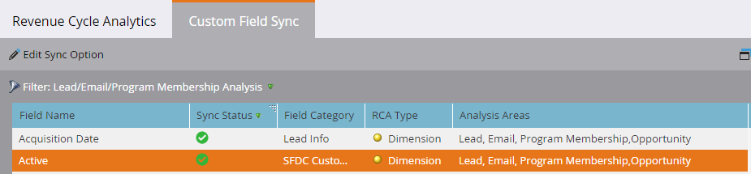

# 为收入周期分析{#enabling-custom-field-sync-for-revenue-cycle-analytics}启用自定义字段同步

以下步骤允许您在RCA报表中使用自定义字段。

1. 单击&#x200B;**管理员**。

   

1. 单击&#x200B;**收入周期分析**，然后单击&#x200B;**自定义字段同步**。

   

1. 选择&#x200B;**字段名称**，然后单击&#x200B;**编辑同步选项**。

   

1. 在“同步状态”下，选择&#x200B;**“已启用**”，然后单击&#x200B;**“保存**”。

   

1. 绿色检查可让您知道字段已设置为同步。

   

   就这样！

   >[!NOTE]
   >
   >启用该字段后，第二天将在收入周期分析中提供该数据。
