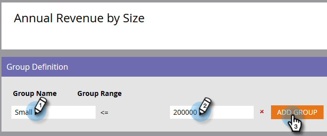

# 使用字段管理器创建自定义字段组 {#create-custom-field-groups-using-the-field-organizer}

在Revenue Cycle Explorer的Model Performance Analysis （潜在客户）区域中启用报表的自定义字段组之前，您必须通过Marketo Lead Management中的Field Organizer将标准或自定义字段分类为报表的组。 这仅适用于潜在客户和公司属性。
当您从“新建字段管理器”对话框的“字段”下拉列表中选择标准或自定义字段时，系统会映射与您要分组的“字段管理器”中三个可用编辑器中之一相关联的Marketo销售线索管理数据类型：字符串、整数或日期。

| Marketo潜在客户管理数据类型 | 字段管理器编辑器数据类型 |
|---|---|
| 字符串 | 字符串 |
| 电子邮件 | 字符串 |
| 整数 | 整数 |
| 文本 | 字符串 |
| URL | 字符串 |
| 引用 | 不支持 |
| 货币 | 整数 |
| 日期时间 | 日期 |
| 布尔值 | 不支持 |
| 电话 | 字符串 |
| 日期 | 日期 |
| 浮动 | 整数 |
| 已计算 | 不支持 |

接下来的三部分将介绍如何为字符串、整数或日期类型创建自定义字段组。

## 创建自定义字段组 — 字符串编辑器 {#create-custom-field-group-string-editor}

1. 单击 **潜在客户数据库**.

   

1. 单击 **新建**，并选择 **新建字段管理器**.

   

1. 单击 **字段** 并选择具有映射到字符串编辑器的数据类型的标准或自定义字段（请参阅上一节中的表）。 此处使用国家/地区。

   

1. 单击&#x200B;**创建**。

   

   新的自定义组显示在Lead Database树中，表示为Field Name > Field Name Group（字段名称>字段名称组）（例如： Country > Country Group）。

   

1. 单击铅笔图标可自定义名称。 例如，您可以将“国家/地区组”重命名为“大陆”。 键入所需的新名称，然后单击以离开自动保存框。

   

1. 默认情况下，所有数据值都放在“其他”子组中。 要对数据值进行分类，请单击 **添加组** 创建子组并为其命名。

   >[!NOTE]
   >
   >您最多可以添加10个子组来对数据值进行分类。 创建的每个子组都分配有一个ID号。

   在此示例中，为大多数大陆创建了组。

   

   >[!NOTE]
   >
   >要删除子组，只需单击子组名称旁边的红色X即可。 如果该组中有任何数据值，则数据值将被移动到默认的“其他”组。

1. 突出显示画布中的数据值，并将这些数据值拖放到相应的子组中。

   

   >[!NOTE]
   >
   >要从子组中删除数据值，请将该数据值重新分配给默认的“其他”组。

1. 使用画布正上方左上角的过滤器选项选择并查看一个或多个子组中的数据值。 基于过滤器选择的数据值将显示在画布中。

   

   >[!NOTE]
   >
   >定义组后，您可以通过Marketo销售线索管理中的收入周期Analytics选项卡，为模型性能分析（销售线索）中的报表启用自定义字段组。

## 创建自定义字段组 — 整数编辑器 {#create-custom-field-group-integer-editor}

1. 单击 **潜在客户数据库**.

   

1. 单击 **新建**，并选择 **新建字段管理器**.

   

1. 单击 **字段** 并选择具有映射到字符串编辑器的数据类型的标准或自定义字段（请参阅上一节中的表）。 年收入在此处使用。

   

1. 单击&#x200B;**创建**。

   

   新的自定义组显示在Lead Database树中，表示为Field Name > Field Name Group（例如： Annual Revenue > Annual Revenue Group）。

   

1. 单击整数编辑器上方的默认自定义群组名称可自定义名称。 例如，您可以将“年收入组”重命名为“按规模的年收入”。 单击 **保存**.

   

   整数编辑器允许您创建多个子组以按大小定义每个子组。 在本例中，将创建三个组以用于小型、中型和企业企业。

1. 要添加您的第一个组，请在 **组名称** 字段（例如： Small）并在 **组范围** 字段(示例： 200000)。 单击 **添加组**.

   

   在刚刚输入的组的下方将显示一个空的组条目。 以下示例显示了适用于中小型企业的一个条目。

   >[!NOTE]
   >
   >您最多可以添加10个子组来对数据值进行分类。 每个“组范围”条目都基于前一个条目。 如果您将您创建的最后一个自定义子组的最后一个组范围条目留空，则不会设置最大数据值。

1. 单击“摘要”选项卡以保存并查看设置。

   

   >[!NOTE]
   >
   >要删除子组，请单击子组名称旁边的红色X。

1. 在“摘要”页面上，查看您的设置。

   

   >[!NOTE]
   >
   >定义组后，您可以通过Marketo销售线索管理中的收入周期Analytics选项卡，为模型性能分析（销售线索）中的报表启用自定义字段组。

## 创建自定义字段组 — 日期编辑器 {#create-custom-field-group-date-editor}

1. 单击 **潜在客户数据库**.

   

1. 单击 **新建**，并选择 **新建字段管理器**.

   

1. 单击 **字段** 并选择具有映射到字符串编辑器的数据类型的标准或自定义字段（请参阅上一节中的表）。 此处使用客户获取日期。

   

1. 单击&#x200B;**创建**。

   

   新的自定义组显示在Lead Database树中，表示为Field Name > Field Name Group（例如： Acquisition Date > Acquisition Date Group）。

   

1. 单击日期编辑器上方的默认自定义群组名称以自定义名称。 例如，您可以将“客户获取日期组”重命名为“客户获取日期类别”。 单击 **保存**.

   

   日期编辑器允许您创建多个子组并按日期定义每个子组。 在此示例中，将创建三个组：Q1-15潜在客户、Q2-15潜在客户和Q3-15潜在客户。

1. 要添加您的第一个组，请在 **组名称** 字段（例如：Q1-15销售线索）并在“日期”字段中输入日期，该日期表示在或之前获得销售线索的日期（例如：Q1-15的最后一天为2015年3月31日）。 单击 **添加组**.

   

   >[!NOTE]
   >
   >您最多可以添加10个子组来对数据值进行分类。 每个“组范围”条目都基于前一个条目。 如果您将您创建的最后一个自定义子组的最后一个组范围条目留空，则不会设置结束日期值。

   以下示例显示了一个进入2015年第1季度后进入第3季度的潜在客户条目。

   

   就是这样！ 干得好。
