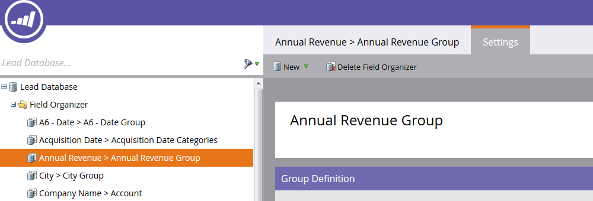

# 使用字段管理器创建自定义字段组 {#create-custom-field-groups-using-the-field-organizer}

在收入周期浏览器的“模型性能分析（潜在客户）”区域中启用报告的自定义字段组之前，您必须先将标准字段或自定义字段分类为组，以便通过Marketo Lead Management中的字段管理器进行报告。 这仅适用于潜在客户和公司属性。
当您从“新建字段管理器”对话框的“字段”下拉菜单中选择标准或自定义字段时，系统将映射与要与“字段管理器”中的三个可用编辑器之一进行分组的字段关联的“营销人员潜在客户管理”数据类型：字符串、整数或日期。

| Marketo潜在客户管理数据类型 | 字段管理器编辑器数据类型 |
|---|---|
| 字符串 | 字符串 |
| 电子邮件 | 字符串 |
| 整数 | 整数 |
| 文本 | 字符串 |
| URL | 字符串 |
| 引用 | 不支持 |
| 货币 | 整数 |
| DateTime | 日期 |
| 布尔值 | 不支持 |
| 电话 | 字符串 |
| 日期 | 日期 |
| 浮动 | 整数 |
| 已计算 | 不支持 |

接下来的三个部分介绍如何为字符串、整数或日期类型创建自定义字段组。

## 创建自定义字段组——字符串编辑器 {#create-custom-field-group-string-editor}

1. 单击“ **潜在客户数据库**”。

   

1. 单击“ **新建**”，然后选择“ **新建字段管理器**”。

   

1. 单击 **“字段** ”，然后选择数据类型映射到字符串编辑器的标准或自定义字段（请参阅上一节中的表）。 这里使用国家。

   

1. 单击 **创建**。

   

   新的自定义组显示在潜在客户数据库树中，表示为字段名称>字段名称组(示例：国家>国家／地区组)。

   

1. 单击铅笔图标以自定义名称。 例如，您可以将“国家／地区组”重命名为“大陆”。 键入所需的新名称，然后单击离开该框以自动保存。

   

1. 默认情况下，所有数据值都放在“其他”子组中。 要对数据值进行分类，请 **单击** “添加组”以创建子组，并为其命名。

   >[!NOTE]
   >
   >最多可以添加十个子组来对数据值进行分类。 创建的每个子组都分配有ID号。

   在此示例中，为大多数大陆创建了组。

   

   >[!NOTE]
   >
   >要删除子组，只需单击该子组名称旁边的红色X。 如果组中有任何数据值，则数据值将移至默认的“其他”组。

1. 在画布中高亮显示数据值，并将数据值拖放到相应的子组中。

   

   >[!NOTE]
   >
   >要从子组中删除数据值，请将数据值重新分配给默认的“其他”组。

1. 使用画布正上方的左上角的过滤器选项，选择并视图一个或多个子组中的数据值。 画布中显示基于筛选器选择的数据值。

   

   >[!NOTE]
   >
   >定义这些组后，您可以通过Marketo Lead Management中的“收入周期分析”选项卡在“模型性能分析（潜在客户）”中为报告启用自定义字段组。

## 创建自定义字段组——整数编辑器 {#create-custom-field-group-integer-editor}

1. 单击“ **潜在客户数据库**”。

   

1. 单击“ **新建**”，然后选择“ **新建字段管理器**”。

   

1. 单击 **“字段** ”，然后选择数据类型映射到字符串编辑器的标准或自定义字段（请参阅上一节中的表）。 此处使用年度收入。

   

1. 单击 **创建**。

   

   新的自定义组显示在潜在客户数据库树中，表示为字段名称>字段名称组(示例：年收入>年收入组)。

   

1. 单击整数编辑器上方的默认自定义用户组名称以自定义该名称。 例如，您可以将“Annual Revenue Group”重命名为“Annual Revenue by Size”。 单击 **保存**。

   

   整数编辑器允许您创建多个子组以按大小定义每个子组。 在此示例中，将为小型、中型和企业业务创建三个组。

1. 要添加您的第一个用户组，请在“用户组名称”字 **段中输入** 名称(示例：“小”)并在“组范围”字段 **中输入** “最大值”(例如：200000)。 单击 **添加组**。

   

   刚刚输入的组下方将显示空组条目。 以下示例显示了适用于中小型企业和企业企业的条目。

   >[!NOTE]
   >
   >最多可以添加十个子组来对数据值进行分类。 每个组范围条目都基于前一条目。 如果您为您创建的最后一个自定义子组将最后一个“组范围”条目留空，则不会设置最大数据值。

1. 单击“摘要”选项卡以保存并查看设置。

   

   >[!NOTE]
   >
   >要删除子组，请单击该子组名称旁边的红色X。

1. 在“摘要”页面上，查看您的设置。

   

   >[!NOTE]
   >
   >定义这些组后，您可以通过Marketo Lead Management中的“收入周期分析”选项卡在“模型性能分析（潜在客户）”中为报告启用自定义字段组。

## 创建自定义字段组——日期编辑器 {#create-custom-field-group-date-editor}

1. 单击“ **潜在客户数据库**”。

   

1. 单击“ **新建**”，然后选择“ **新建字段管理器**”。

   

1. 单击 **“字段** ”，然后选择数据类型映射到字符串编辑器的标准或自定义字段（请参阅上一节中的表）。 此处使用客户获取日期。

   

1. 单击 **创建**。

   

   新的自定义组显示在潜在客户数据库树中，表示为字段名称>字段名称组(示例：收购日期>收购日期组)。

   

1. 单击日期编辑器上方的默认自定义用户组名称以自定义该名称。 例如，您可以将“客户获取日期组”重命名为“客户获取日期类别”。 单击 **保存**。

   

   使用日期编辑器，您可以创建多个子组并按日期定义每个子组。 在此示例中，将创建三个组：Q1-15潜在客户，Q2-15潜在客户，Q3-15潜在客户。

1. 要添加您的第一个用户组，请在“用户组名称”字 **段中输入** 名称(示例：Q1-15 Leads)，并在日期字段中输入一个日期，该日期表示在或之前获得该潜在客户的日期(例如：2015年第1-15季度最后一天)。 单击 **添加组**。

   

   >[!NOTE]
   >
   >最多可以添加十个子组来对数据值进行分类。 每个组范围条目都基于前一条目。 如果您为您创建的最后一个自定义子组将最后一个“组范围”条目留空，则不会设置结束日期值。

   

   就这样！ 干得好。

以下示例显示了2015年第1季度到第3季度的销售线索条目。